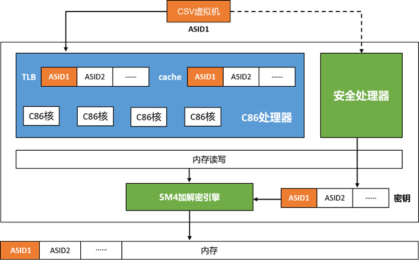

# 海光CSV：海光安全虚拟化技术

## 项目位置链接

https://gitee.com/anolis/cloud-kernel  
https://gitee.com/anolis/hygon-edk2  
https://gitee.com/anolis/hygon-qemu  
https://github.com/inclavare-containers/librats  
https://github.com/inclavare-containers/rats-tls  

## 项目归属SIG

云原生机密计算SIG

## 技术自身介绍

### 背景

容器技术的出现，使应用程序的打包、分发变得非常简单易用，Kubernetes等容器编排技术的出现，进一步加速了容器生态的普及和发展，目前容器已经逐渐成为云计算的主要运行单元。但是由于传统容器共享操作系统内核，在隔离性和安全性上比传统虚拟机差。为了解决这个问题，Kata容器应运而生，Kata容器运行在轻量级虚拟机里，比起传统容器提供了更好的隔离性和安全性，使Kata容器同时具有容器技术带来的易用性和虚拟机技术带来的安全性。随着机密计算需求的出现，CPU厂商纷纷推出了硬件TEE技术，传统虚拟机技术已无法满足机密计算的需要，Kata容器的安全性需要进一步增强以便应用于机密计算场景。

### 问题&挑战

虚拟化是云计算的底层基础技术，随着云计算的发展而被广泛应用。由于虚拟机的全部资源被主机操作系统和虚拟机管理器管理和控制，虚拟化本身有较严重的安全缺陷，主机操作系统和虚拟机管理器可任意读取和修改虚拟机资源且虚拟机无法察觉。主机操作系统和虚拟机管理器有权读写虚拟机代码段，虚拟机内存数据，虚拟机磁盘数据，并有权重映射虚拟机内存等。攻击者可利用主机操作系统和虚拟机管理器的安全缺陷获取操作系统的权限后攻击虚拟机，给虚拟机最终用户造成重大损失。

### 解决方案

CSV是海光自主研发的安全虚拟化技术，采用国密算法实现，CSV虚拟机在写内存数据时CPU硬件自动加密，读内存数据时硬件自动解密，每个CSV虚拟机使用不同的密钥。海光CPU内部使用ASID（Address Space ID）区分不同的CSV虚拟机和主机，每个CSV虚拟机使用独立的Cache、TLB等CPU资源，实现CSV虚拟机、主机之间的资源隔离。CSV虚拟机使用隔离的硬件资源，支持启动度量、远程认证等功能，是安全的硬件可信执行环境。

CSV机密容器技术将安全虚拟化技术与Kata容器技术结合，实现容器运行环境的度量和加密，容器中的程序可以使用远程认证功能实现身份证明。CSV机密容器和普通容器的接口完全兼容，用户可以使用Docker或者Kubernetes启动机密容器，实现对容器数据的隔离和保护。

CSV技术构建了以安全加密虚拟机为基础的可信执行环境。在安全加密虚拟机保证了虚拟机数据机密性的基础上，更进一步保证了虚拟机数据的完整性，主机操作系统和虚拟机管理无法通过改写虚拟机嵌套页表对虚拟机实施重映射攻击。

## 应用场景

安全加密虚拟化可以保证最终用户数据的机密性和完整性，可用于实施机密计算，适用于云计算和隐私计算场景。
