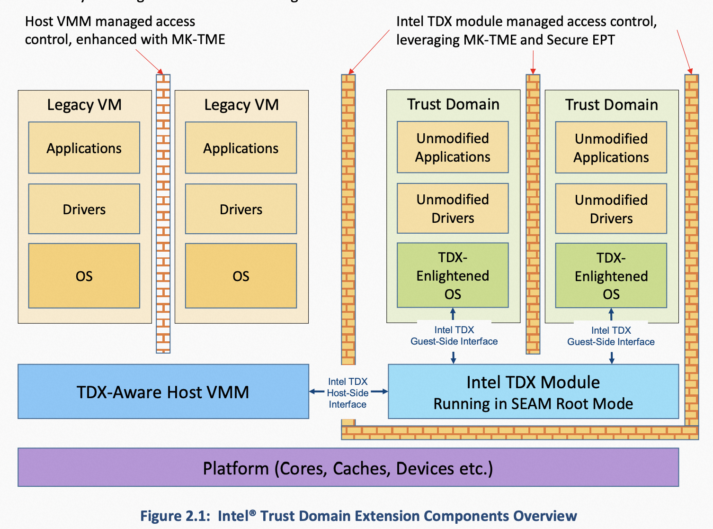

# Intel TDX: Intel安全虚拟化技术

## 项目归属SIG

云原生机密计算SIG

## 背景

近年来，随着隐私保护的呼声和关注度越来越高，越来越多的人开始关注集中化的云基础设施存在泄露租户隐私和敏感数据的风险。在此背景下，机密计算这一新的计算形态应运而生。

机密计算是通过在基于硬件的可信执行环境（Trusted Execution Environment，TEE）中执行计算过程的全新计算模式，它能够对使用中的数据进行保护与隔离，防止具有特权的云基础设施提供方对租户的应用程序和数据进行未经授权的访问。

## 问题&挑战

越来越多的租户业务尤其是企业负载需要利用云计算提供的弹性资源进行海量数据处理。这类租户要求CSP能够提供更好的安全和隔离解决方案，尤其是在处理租户敏感数据这一计算阶段的过程中，租户的敏感数据不能以明文形式暴露在内存中，而租户的安全性又不依赖于CSP。

## 解决方案

Intel Trust Domain Extensions（简称TDX）引入了一种新的、基于硬件隔离的虚拟机工作负载形态，所谓的Trust Domain（简称TD）。TDX是一种典型的机密计算技术，可以在在租户不可信的云基础设施上，为租户的工作负载提供一个系统级（相比Intel SGX机密计算技术提供的应用级粒度）的安全可信的执行环境，同时保证租户运行环境的机密性和完整性。为此，需要将当前租户的TD，与CSP控制的特权级系统组件（比如VMM/hypervisor）、VM以及其他租户的TD都隔离开来，并将它们排除出当前租户的TCB，以确保当前租户的TD不受上述组件的影响。

与VM相比，TD额外增加了以下能力：

- 提供了VM内存的机密性和完整性保护
- 地址转换完整性保护
- CPU状态机密性和完整性保护
- 对安全中断和异常的分发机制
- 远程证明

TDX技术综合了MKTME（多密钥全加密内存）与VMX虚拟化技术，再添加新的指令集、处理器模式和强制实施的访问控制等设计。

## 用户情况

目前Intel TDX已经在主流云平台上提供相关实例或部署计划：
1. 阿里云8代ECS 提供的TDX机密计算实例已经上线邀测。
2. Microsoft Azure TDX机密计算实例也计划今年晚些时候提供服务。