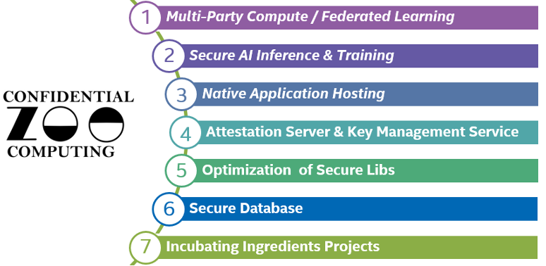
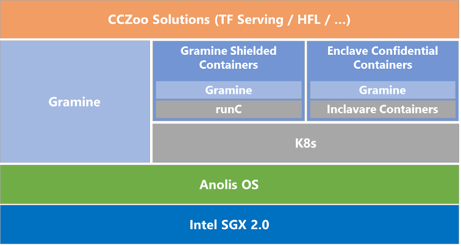

# Intel Confidential Computing Zoo

## 项目位置链接

https://github.com/intel/confidential-computing-zoo

## 归属社区SIG

云原生机密计算SIG

## 技术自身介绍

### 问题&挑战

目前，机密计算还处于早期阶段，用户对SGX和TDX技术的了解和使用还需要进一步的加深和推广，对特定应用场景下如何结合Intel TEE技术以及其他安全技术打造全链路的机密计算方案缺少相应的设计参考。

### 解决方案

为了帮助用户快速了解和使用Intel TEE技术，便捷快速地设计和开发出相关机密计算安全解决方案，Intel发起并开源了Confidential Computing Zoo(CCZoo)， CCZoo集合了不同的安全技术栈，提供了基于不同应用场景下的各种典型端到端的安全解决方案的参考案例，这些参考案例贴近实际的商业案例，让用户增加在机密计算方案设计和实现的体验，同时，引导用户结合相应的参考案例，快速设计和实现出自己特定的机密计算方案。此外，CCZoo还会选择在不同公有云，例如阿里云ECS，部署和验证已发布的端到端的机密计算方案，为用户提供相关的云上部署特有的配置参考信息，帮助用户方案快速上云。

### 技术介绍图片

CCZoo当前提供了6个类别的机密计算场景和1个孵化期项目集，具体分类如下图所示。为了方便部署，大部分的方案采用了容器化的集成。在不同的机密计算场景下，CCZoo选择使用了不同的安全技术组件模块，主要包括：Runtime Security、LibOS、Remote Attestation、KMS、TLS。用户可以通过对不同参考案例的部署增加对不同安全组件的使用和选择。

- Runtime Security: 当前主要使用Intel SGX，基于应用程序级别的隔离，对用户的应用和数据进行保护。
- LibOS: Gramine和Occlum。通过LibOS运行现有应用程序，只需进行细微修改或无需修改，即可在Intel SGX Enclave中运行。
- Remote Attestation: 提供了具体RA-TLS能力集成的gRPC框架，方便用户将远程认证的功能需要集成到自有框架中。
- KMS: 提供了集成远程认证加密钥管理的功能模块。
- TLS: 集成了RA-TLS功能，并启用了证书验证机制。

CCZoo将会跟Anolis Cloud Native Confidential Computing(CNCC) SIG展开合作，将CCZoo中不同机密计算场景下的方案，结合Anolis的技术框架进行实现和部署，如下图所示。

## 应用场景

CCZoo中多场景下的机密计算方案可以帮助CNCC SIG 进一步丰富用户基于Anolis的安全方案使用场景，为用户提供了最佳实践。同时，CCZoo也会基于方案级别，对Anolis进行全栈式的测试和验证，从用户实际使用的角度，来验证Anolis的可靠性和功能性。
