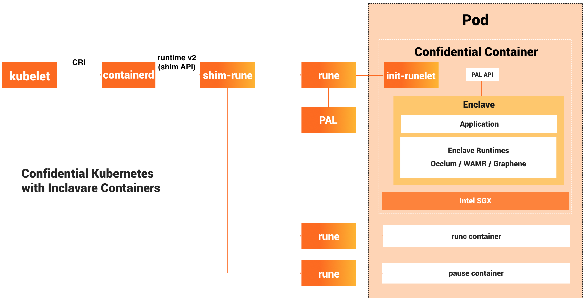

# Inclavare Containers

## 项目位置链接

https://github.com/inclavare-containers

## 归属社区SIG

云原生机密计算SIG

## 技术自身介绍

### 背景

机密计算是一种能够通过软件加密算法和硬件HW-TEE保护用户数据和程序的技术。 在云原生场景中， 机密级算能够对计算中的数据提供机密性和完整性保护， 并能够有效防止云提供商和任何高权限的第三方对执行环境中的数据进行窃取和篡改。

### 问题&挑战

对于数据隐私和数据安全度关注高的用户， 不愿意冒风险，把自己的业务部署在共有云上， 因为云提供商具有查看用户隐私数据和业务的可能性， 这也阻止了一些企业上云的脚步。随着机密计算蓬勃发展，硬件厂商提供了HW-TEE硬件加密的方案的涌现， 可以有效解决安全敏感度较高的用户上云顾虑。 对于公有云人们开发和部署很多是以容器的方式进行， 如何让HW-TEE和容器技术相结合，成为云厂商迫切要解决的问题。

### 解决方案

Alibaba和Intel把Intel-SGX和容器技术相结合， 创新性的开发出了机密容器Inclavare containers, 完美兼容容器标准，并能够为客户的数据和程序进行保驾护航， 并且Inclavare containers 容器成为CNCF的第一个机密容器。

### 技术介绍图片

## 应用场景

