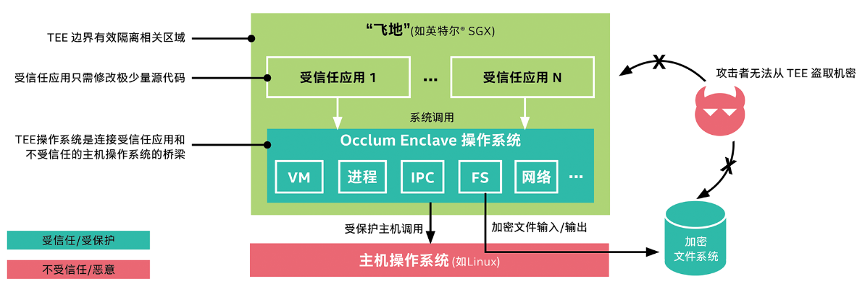

# Occlum

## 项目位置链接

https://github.com/occlum/occlum

## 项目归属SIG

云原生机密计算SIG

## 技术自身介绍

### 背景

数据在使用中的隐私安全问题越来越受到业界的广泛关注。其中，基于硬件的TEE技术，尤其是英特尔® 软件防护扩展（英特尔® SGX）是TEE技术里应用最广泛的。它提供基于硬件的内存加密，隔离内存中的特定应用代码和数据，能够更有效地抵御多种类型的攻击。它可显著加强数据安全，满足对于机密计算的广泛需求。英特尔® SGX 允许为用户级代码分配专用内存区域（Encalve，安全飞地），以免受到拥有更高权限的进程的影响。英特尔® SGX 经过了严格测试，是业界广泛部署的基于硬件的数据中心可信执行环境 (TEE)，大幅减少了系统中的攻击面。

### 问题&挑战
传统的基于SGX SDK的编程方式，对应用开发者来说是一个极大的挑战。它需要应用开发者在熟悉TEE/SGX SDK的基础上，重新设计，分割，编译已有的应用，对广发应用TEE技术于各种应用来说，难度极大。 

### 解决方案

Occlum是基于SGX基础上实现的一套轻量级LibOS，大大简化了应用开发者的难度。使用 Occlum 后，机器学习工作负载等只需修改极少量（甚至无需修改）源代码即可在英特尔® SGX 上运行，以高度透明的方式保护了用户数据的机密性和完整性。

### 结果

大大简化，加速了机器学习等大规模应用运行在TEE（SGX）环境。

### 技术介绍图片

## 应用场景

### 场景描述

Occlum为蚂蚁摩斯（TEE 服务平台，将 TEE 能力作为一种 SaaS 服务开放出来）提供技术底座。
Occlum为Intel的一个分布式的隐私保护机器学习（Privacy Preserving Machine Learning, PPML）平台提供TEE技术底座。

### 应用效果

总体上来说，Occlum强大高效的LibOS使得用户的应用可以很方便的运行在TEE环境里，并且性能上，兼容性上都高于竞品。
竞品分析
Gramine，另一个比较流行的基于SGX基础上的LibOS。相比较于Gramine，Occlum提供轻量级LibOS流程: 它们是轻量级的，因为所有LibOS流程共享同一个SGX enclave。 与重型、per-enclave的LibOS进程相比，Occlum的轻型LibOS进程在启动时最高快1000倍，在IPC上快3倍。
