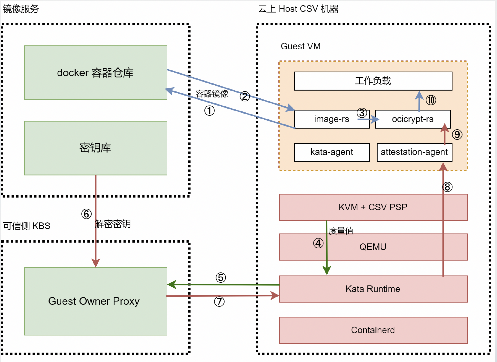

# 基于pre-attestation使用机密容器


本文主要为您介绍如何在kata环境中基于海光安全加密虚拟化功能CSV(China Secure Virtualization)技术，通过pre-attestaion 认证方式，启动一个租户的加密容器镜像。

## 前提条件

请参考《基于runtime-attestation使用机密容器》指南的前提条件一节，完成对系统环境的检查和配置。

## 背景信息



①②③：containerd 调用 kata-runtime创建CSV VM，kata-runtime调用 image-rs 下载加密镜像；

④⑤：kata-runtime 获取 CSV VM 的 launch_measurement发送给 gop-server；

⑥⑦：gop-server 调 用 hag 对 launch_measurement 计算和校验; 验证 gop-server 调用 hag 对 key 进行加密、形成 secret 和 secret_header，发送给 kata-runtime

 ⑧：kata-runtime 调用 qemu 向 CSV VM 注入 secret；CSV VM 利用固件解密 secret 获取 key 存入指定位置； 

⑨：CSV VM 中的 attestation-agent 获取 key，image-rs 使用 key 解密镜像；

⑩：启动镜像运行 workload

## 步骤一：配置权限

请参考《基于runtime-attestation使用机密容器》指南的步骤一，完成配置权限。


## 步骤二：安装kata 环境

Kata Containers是一个开源的、致力于用轻量级虚拟机构建一个安全的容器运行时的实现，这些虚拟机在感觉和执行上与容器类似，但使用硬件虚拟化技术作为第二层防御，提供了更强的工作负载隔离。

关于项目的更多信息，请参见[kata-container](https://github.com/confidential-containers/kata-containers-CCv0)。

### 1. 安装kata-containers

请执行以下命令，安装kata-containers。
```shell
yum-config-manager --add-repo https://mirrors.openanolis.org/inclavare-containers/anolis8.4 && \
 rpm --import https://mirrors.openanolis.org/inclavare-containers/anolis8.4/RPM-GPG-KEY-rpm-sign && \
 yum install -y kata-static
```

### 2. 安装qemu
pre-attestation过程中，CSV VM的measurement计算需要qemu支持kernel-hashes，在qemu 6.2.0之后开始支持kernel-hashes标志，此处提供的qemu是基于6.2.0版本构建。

```shell
yum install -y qemu-system-x86_64
```

### 3. 安装guest kernel，initrd，OVMF
ccv0-guest中包含kata运行CSV VM所需的guest kernel、initrd、OVMF、cmdline等文件。
其中：

guest的rootfs和kernel，需使用efi_secret的内核模块以支持向文件系统中注入secret，加入AA并修改AA设置，自行构建请参考[guest Rootfs and Kernel](https://github.com/confidential-containers/documentation/blob/main/demos/sev-demo/README.md#rootfs-and-kernel) ；

这里提供的OVMF是基于f0f3f5aae7c4d346ea5e24970936d80dc5b60657 进行构建的，也可以使用[edk2-stable202108](https://github.com/tianocore/edk2/releases/tag/edk2-stable202108)后的版本自行构建，以支持CSV.

```shell
yum -y install ccv0-guest
```

cmdline中记录了CSV VM启动时所需的参数信息，需根据实际使用情况进行修改。可参考以下命令：
```sh
cat <<EOF | sudo tee /opt/csv/ccv0-guest/cmdline
tsc=reliable no_timer_check rcupdate.rcu_expedited=1 i8042.direct=1 i8042.dumbkbd=1 i8042.nopnp=1 i8042.noaux=1 noreplace-smp reboot=k console=hvc0 console=hvc1 cryptomgr.notests net.ifnames=0 pci=lastbus=0 quiet panic=1 nr_cpus=`cat /proc/cpuinfo| grep processor | wc -l` scsi_mod.scan=none agent.config_file=/etc/agent-config.toml
EOF
```

### 4. 安装kata-runtime
pre-attestation使用的kata-runtime，需要基于[confidential-containers](https://github.com/confidential-containers) 项目的 [kata-containers-CCv0](https://github.com/confidential-containers/kata-containers-CCv0/tree/CCv0) 的CCv0分支，并加入[CCv0: SEV prelaunch attestation by jimcadden · Pull Request #3025 · kata-containers/kata-containers · GitHub](https://github.com/kata-containers/kata-containers/pull/3025)上的pre-attestation 的支持patch f682220d 和 d2c3f372；
同时也需要使用修改后的[CPUID](https://github.com/fenghao429/cpuid.git) 以支持Hygon CPU。

```sh
yum -y install kata-runtime
```

### 5. 配置kata-runtime
执行以下命令，配置kata 运行时。

这里修改了kata-runtime默认配置中的qemu、guest kernel && initrd && OVMF路径；

使能confidential-guest选项并加入guest_attestation_proxy、guest_attestation_keyset、attestation-agent-config等配置；

将默认内存大小由2048调整为8000；

将共享文件系统由"virtio-fs"调整为"virtio-9p"。

```sh
mkdir -p /etc/kata-containers/ && \
cp /opt/kata/share/defaults/kata-containers/configuration.toml /etc/kata-containers/ && \
cd /etc/kata-containers/ && \
sed -i 's/opt\/kata\/bin\/qemu-system-x86_64/opt\/qemu\/bin\/qemu-system-x86_64/' configuration.toml && \
sed -i 's/kata\/share\/kata-containers\/vmlinux.container/csv\/ccv0-guest\/vmlinuz-5.15.0-rc5+/' configuration.toml && \
sed -i 's/image = \"\/opt\/kata\/share\/kata-containers\/kata-containers/initrd = \"\/opt\/csv\/ccv0-guest\/initrd.pre/' configuration.toml && \
sed -i 's/\# confidential_guest/confidential_guest/' configuration.toml && \
sed -i '/confidential_guest/a\guest_attestation = true\nguest_attestation_proxy = \"localhost:50051\"\nguest_attestation_keyset = \"KEYSET-1\"' configuration.toml && \
sed -i 's/kernel_params = \"\"/kernel_params = \"agent.config_file=\/etc\/agent-config.toml\"/' configuration.toml && \
sed -i 's/firmware = \"\"/firmware = \"\/opt\/csv\/ccv0-guest\/OVMF.fd\"/' configuration.toml && \
sed -i 's/default_memory = 2048/default_memory = 8000/' configuration.toml && \
sed -i 's/shared_fs = \"virtio-fs\"/shared_fs = \"virtio-9p\"/' configuration.toml && \
sed -i 's/\#service_offload/service_offload/' configuration.toml
```

## 步骤三：安装containerd

请参考《基于runtime-attestation使用机密容器》指南的步骤三来安装containerd。

## 步骤四：搭建运行环境

请参考kubernetes[官方指南](https://github.com/kubernetes/kubernetes)安装Kubernetes cluster。搭建kubenetes运行环境。

## 步骤五：安装并启动GOP KBS

GOP（guest owner proxy）用于验证CSV VM的启动，并有条件地提供一个secret，是一项非常复杂的操作。该工具设计用于在可信环境中运行，提供验证和sercret注入服务。

### 1. 请执行以下命令，安装GOP KBS

```shell
yum install -y gop
```

初始化：

```
cd /opt/csv/guest-owner-proxy
./make_grpc.sh
```

### 2. 安装hag

hag是海光提供的工具，主要用于建立和管理服务器的csv证书链，确保csv虚拟机在安全可靠的环境下执行，不受主机干扰。
```shell
yum install -y hag
```

### 3. 使用hag生成证书链

```shell
rm -rf /opt/csv/*cert /opt/csv/*txt /opt/csv/*bin /tmp/csv-guest-owner-proxy/ && \
  cd /opt/csv && \
  hag  --pdh_cert_export
```

### 4. 修改脚本适配本机环境

将keysets.json中的min-api-major、min-api-minor、allowed-build-ids分别改为hag --platform_status显示的api_major、api_minor、build_id

将gop-client.py中hw_api_major、hw_api_minor、hw_build_id分别改为hag --platform_status显示的api_major、api_minor、build_id

将gop-server.py中的build_id值改为与gop-client.py中hw_build_id相同

### 5. 启动GOP server

```shell
cd /opt/csv/guest-owner-proxy/ && \
  ./make_grpc.sh && \
  ./gop-server.py
```

## 步骤六：制作加密镜像

### 1. 制作加密镜像
请参考[指南](https://github.com/confidential-containers/documentation/tree/v0.2.0/demos/sev-demo#preparing-an-image)制作加密镜像。
在本例中可以使用 docker.io/haosanzi/busybox-v1:encrypted 作为镜像进行测试。

### 2. 将加密key保存到GOP的keys.json文件中

GOP的keys.json文件路径：`/opt/csv/guest-owner-proxy/keys.json`。

## 步骤七：部署加密镜像

### 1. 创建RuntimeClass对象kata
用户可以使用RuntimeClass为pod指定不同的运行时，这里使用kata作为验证时使用的运行时。

在集群中执行以下命令，创建RuntimeClass对象kata。
```shell
cat <<-EOF | kubectl apply -f -
apiVersion: node.k8s.io/v1
kind: RuntimeClass
metadata:
  name: kata
handler: kata
EOF

```

### 2. 部署pod
如果 pod 的 runtimeClassName 设置为 kata，CRI 插件会使用 Kata Containers 运行时运行 pod。

执行以下命令，部署名称为busybox的pod。

```shell
cat <<-EOF | kubectl apply -f -
apiVersion: v1
kind: Pod
metadata:
  name: nginx-sandbox
spec:
  runtimeClassName: kata
  containers:
  - image: docker.io/haosanzi/busybox-v1:encrypted
    command: 
      - top
    imagePullPolicy: IfNotPresent
    name: alphine-haosanzi
  restartPolicy: Never
EOF

```
### 3. 测试加密镜像是否部署成功

执行以下命令，查看加密镜像是否部署成功：

```
kubectl get pods
```

从上述输出信息可知已部署成功。

```sh
NAME            READY   STATUS    RESTARTS   AGE
nginx-sandbox   1/1     Running   0          50s
```