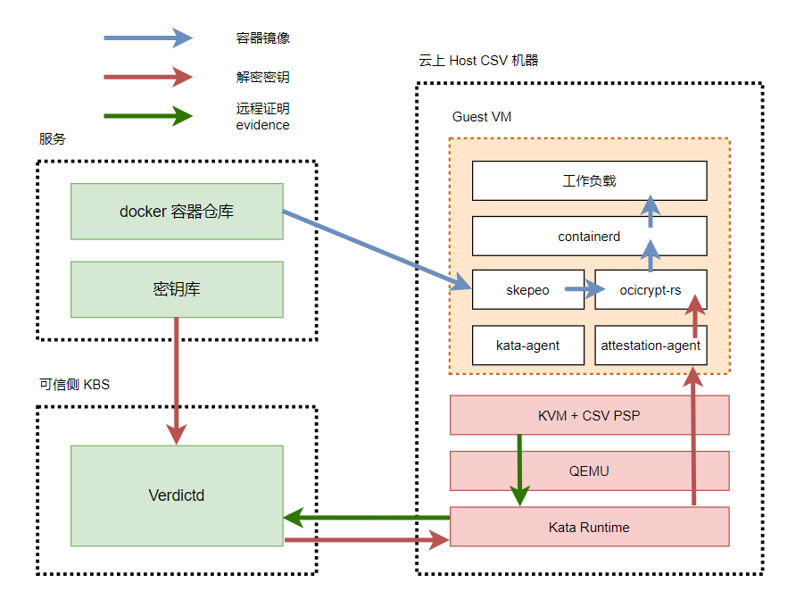

# 基于runtime-attestation使用机密容器

本文主要为您介绍如何在kata环境中基于海光安全加密虚拟化功能CSV(China Secure Virtualization)技术，通过runtime-attestaion 认证方式，启动一个租户的加密容器镜像。

## 前提条件

请使用安装Hygon CPU的硬件设备，硬件信息参考如下：

- CPU型号：Hygon C86 7291 32-core Processor
- 固件版本：1600及以上
- BIOS设置：开启SME

BIOS选项SMEE用来控制是否打开内存加密功能，SMEE=Enable表示在BIOS中打开内存加密功能，SMEE=Disable表示在BIOS中关闭内存加密功能。

### 1. 安装Anolis 8.4 操作系统

请参考[Anolis 8.4 GA说明文档](https://mirrors.openanolis.cn/anolis/8.4/isos/GA/ReadMe.txt)安装anolis 8.4 GA。

### 2. 升级kernel到5.10

Anlois 8.4 的默认内核版本是4.19，5.10的内核上支持[CSV远程证明功能](https://gitee.com/anolis/cloud-kernel/pulls/14)。请升级kernel 到5.10版本。

1. 请参考以下命令，添加Anolis的Experimental repo，并将kernel升级至5.10。
```
yum-config-manager --add-repo https://mirrors.openanolis.cn/anolis/8/kernel-5.10/x86_64/os/ && \
  yum update kernel
```
2. 配置bootloader。
```
grubby --update-kernel=ALL --args="mem_encrypt=on kvm_amd.sev=1"
```
3. 重启机器，请输入以下命令查看内核版本。
```shell
uname -r
```
预期输出：
```shell
5.10.134-12.an8.x86_64
```

**注意！！**  

如果您使用的是Anolis 8.6 GA镜像，可能会碰到使能SEV之后，机器Hang住无法进入系统的情况。请参考以下步骤降级grub2-efi之后，可以正常启动这个特性

```sh
yum downgrade grub2-efi
```

### 3. 检查CSV使能状态 

1.  在操作系统内执行：
```
dmesg | grep -i sev
```

出现如下结果时，表示CSV已经使能。 

```
[    9.179127] ccp 0000:05:00.2: sev enabled
[   10.297951] ccp 0000:05:00.2: SEV API:1.2 build:0
[   10.311454] SEV supported: 11 ASIDs
```

2.  检查kvm_amd和ccp模块是否成功安装。
```
lsmod | grep kvm
```


### 4. 使用hag检查固件版本信息

1. 安装hag

```sh
yum-config-manager --add-repo https://mirrors.openanolis.org/inclavare-containers/anolis8.4 && \
 rpm --import https://mirrors.openanolis.org/inclavare-containers/anolis8.4/RPM-GPG-KEY-rpm-sign && \
 yum install -y hag
```

2. 通过hag获得平台状态

```sh
sudo hag --platform_status
api_major:           1
api_minor:           2
platform_state:      CSV_STATE_INIT
owner:               PLATFORM_STATE_SELF_OWN
chip_secure:         SECURE
fw_enc:              ENCRYPTED
fw_sign:             SIGNED
es:                  CSV ES
build id:            1600
bootloader version:  0.0.0
guest_count:         0
supported csv guest: 11
platform_status command successful
```

注意：固件build id要大于等于1600才可以支持远程证明。若版本低于1600，请联系BIOS厂商提供PI版本>=2.1.0.2的BIOS。


## 背景信息



1. CSV VM启动；

2. 下载加密镜像时才会通过attestation-agent将通过vm-attestation hypercall获取的包括attestation-report 、chip-id等内容的CSV VM evidence发送给verdictd server校验；

3. 校验通过后virdictd才与attestation-agent建立基于rats-tls的可信硬件环境的安全通道、并将加密镜像的解密key通过该安全通道发送给attestation-agent；

4. CSV VM利用步骤3获得的解密key解密镜像，运行工作负载

## 步骤一：配置权限
### 1. 关闭firewall

Linux系统下面自带了防火墙iptables，iptables可以设置很多安全规则。但是如果配置错误很容易导致各种网络问题。此处建议关闭firewall。执行如下操作：

```sh
sudo service firewalld stop
```


### 2. 关闭selinux

Security-Enhanced Linux（SELinux）是一个在內核中实施的强制访问控制（MAC）安全性机制。  为避免出现权限控制导致的虚拟机启动、访问失败等问题，此处建议关闭selinux。执行如下操作：

```sh
sudo setenforce 0
sudo sed -i 's/^SELINUX=enforcing$/SELINUX=permissive/' /etc/selinux/config
```


## 步骤二：安装kata 环境

Kata Containers是一个开源的、致力于用轻量级虚拟机构建一个安全的容器运行时的实现，这些虚拟机在感觉和执行上与容器类似，但使用硬件虚拟化技术作为第二层防御，提供了更强的工作负载隔离。

关于项目的更多信息，请参见[kata-container](https://github.com/confidential-containers/kata-containers-CCv0)。

### 1. 安装kata-containers

1. 请执行以下命令，安装kata-containers。
```shell
yum install -y kata-static
```

2. 运行以下命令，查看kata-containers是否安装成功。
```shell
tree /opt/kata/
```


### 2. 安装qemu
此处使用的qemu基于6.2.0构建。

```shell
yum install -y qemu-system-x86_64
```

### 3. 安装guest kernel，initrd，ovmf
ccv0-guest中包含kata运行CSV VM所需的guest kernel、initrd、OVMF、cmdline等文件。
其中：
guest的rootfs和kernel，需使用efi_secret的内核模块以支持向文件系统中注入secret，加入AA并修改AA设置，自行构建请参考[guest Rootfs and Kernel](https://github.com/confidential-containers/documentation/blob/main/demos/sev-demo/README.md#rootfs-and-kernel) ；
这里提供的OVMF是基于f0f3f5aae7c4d346ea5e24970936d80dc5b60657 进行构建的，也可以使用[edk2-stable202108](https://github.com/tianocore/edk2/releases/tag/edk2-stable202108)后的版本自行构建，以支持CSV。

```shell
yum install -y ccv0-guest
```

cmdline中记录了CSV VM启动时所需的参数信息，需根据实际使用情况进行修改。可参考以下命令：
```sh
cat <<EOF | sudo tee /opt/csv/ccv0-guest/cmdline
tsc=reliable no_timer_check rcupdate.rcu_expedited=1 i8042.direct=1 i8042.dumbkbd=1 i8042.nopnp=1 i8042.noaux=1 noreplace-smp reboot=k console=hvc0 console=hvc1 cryptomgr.notests net.ifnames=0 pci=lastbus=0 quiet panic=1 nr_cpus=`cat /proc/cpuinfo| grep processor | wc -l` scsi_mod.scan=none agent.config_file=/etc/agent-config.toml
EOF
```
### 4. 安装kata-runtime

kata-runtime运行CSV VM。

```
yum -y install kata-runtime
```
### 5. 配置kata-runtime
执行以下命令，配置kata 运行时：
这里修改了kata-runtime默认配置中的qemu、guest kernel && initrd && OVMF路径；
使能confidential-guest选项并加入attestation-agent-config配置；
将默认内存大小由2048调整为8000；
将共享文件系统由"virtio-fs"调整为"virtio-9p"。
```
mkdir -p /etc/kata-containers/ && \
cp /opt/kata/share/defaults/kata-containers/configuration.toml /etc/kata-containers/ && \
cd /etc/kata-containers/ && \
sed -i 's/opt\/kata\/bin\/qemu-system-x86_64/opt\/qemu\/bin\/qemu-system-x86_64/' configuration.toml && \
sed -i 's/kata\/share\/kata-containers\/vmlinux.container/csv\/ccv0-guest\/vmlinuz-5.15.0-rc5+/' configuration.toml && \
sed -i 's/image = \"\/opt\/kata\/share\/kata-containers\/kata-containers/initrd = \"\/opt\/csv\/ccv0-guest\/initrd.run/' configuration.toml && \
sed -i 's/\# confidential_guest/confidential_guest/' configuration.toml && \
sed -i 's/kernel_params = \"\"/kernel_params = \"agent.config_file=\/etc\/agent-config.toml\"/' configuration.toml && \
sed -i 's/firmware = \"\"/firmware = \"\/opt\/csv\/ccv0-guest\/OVMF.fd\"/' configuration.toml && \
sed -i 's/default_memory = 2048/default_memory = 8000/' configuration.toml && \
sed -i 's/shared_fs = \"virtio-fs\"/shared_fs = \"virtio-9p\"/' configuration.toml && \
sed -i 's/\#service_offload/service_offload/' configuration.toml
```

## 步骤三：安装containerd
Containerd是一个行业标准的容器运行时，强调简单性、健壮性和可移植性。它可以作为Linux和Windows的守护进程，可以管理其主机系统的完整容器生命周期:图像传输和存储、容器执行和监督、底层存储和网络附件等。
更多信息请参考[containerd](https://github.com/containerd/containerd)

1. 执行以下命令，安装containerd
```shell
sudo yum install -y containerd
```

2. 启动containerd

```shell
sudo systemctl enable /etc/systemd/system/containerd.service
sudo systemctl daemon-reload
sudo service containerd restart
```

预期输出类似如下：
```
● containerd.service - containerd container runtime
   Loaded: loaded (/etc/systemd/system/containerd.service; disabled; vendor preset: disabled)
   Active: active (running) since Thu 2022-03-31 16:52:43 CST; 1s ago
     Docs: https://containerd.io
  Process: 1884520 ExecStartPre=/sbin/modprobe overlay (code=exited, status=0/SUCCESS)
 Main PID: 1884522 (containerd)
    Tasks: 34
   Memory: 46.8M
   CGroup: /system.slice/containerd.service
           └─1884522 /usr/bin/containerd
```

## 步骤四：搭建kubenetes运行环境

请参考kubernetes[官方指南](https://github.com/kubernetes/kubernetes)安装Kubernetes cluster。搭建kubenetes运行环境。


## 步骤五：安装并启动verdictd

Verdictd是一种远程认证实现，由一组构建块组成，这些构建块利用Intel/AMD的安全特性来发现、验证和支持关键的基础安全和机密计算用例。它依靠RATS-TLS应用远程认证基础和标准规范来维护平台数据收集服务和高效的验证引擎来执行全面的信任评估。这些信任评估可用于管理应用于任何给定工作负载的不同信任和安全策略。
更多信息请参考[verdictd](https://github.com/inclavare-containers/verdictd)项目文档。
### 1. 请执行以下命令，安装verdictd

```shell
yum install -y verdictd
```

### 2. 配置CSV OPA文件

#### 获得measurement

CSV 机器容器启动的时候，要对kernel,intird,ovmf和cmdline进行度量，来确保云上启动的guest VM的确是符合预期的CSV VM。

默认情况下，请使用/opt/csv/calculate_hash.py计算measurement。

为确保/opt/csv/calculate_hash.py运行正常，请安装snowland-smx模块，以pip3为例：

```sh
pip3 install snowland-smx
```

安装完成后执行：

```sh
yum install -y gop 
/opt/csv/calculate_hash.py --ovmf  /opt/csv/ccv0-guest/OVMF.fd --kernel /opt/csv/ccv0-guest/vmlinuz-5.15.0-rc5+  --initrd /opt/csv/ccv0-guest/initrd.run.img --cmdline /opt/csv/ccv0-guest/cmdline
```

输出结果类似如下：
```sh
Calculating hash of kernel at /opt/csv/ccv0-guest/vmlinuz-5.15.0-rc5+
Calculating hash of initrd at /opt/csv/ccv0-guest/initrd.run.img
Calculating hash of kernel params (/opt/csv/ccv0-guest/cmdline)
Firmware Digest:  OJXIhq3PHbknNmpAIy8YpUHOpY0wvGRXULOW8djVAZA=
```

**注意**：如果您修改了Kata的 配置文件（/etc/kata-containers/configuration.toml），可能会影响cmdline的内容。

请您用`ps -ef | grep qemu` 输出qemu实际启动VM的命令参数，然后参考`-append`的参数获得guest VM的cmdline. 最后重新使用/opt/csv/calculate_hash.py脚本计算measurement.

例如：
```sh
# ps -ef 
/opt/qemu/bin/qemu-system-x86_64 
...
-kernel /opt/csv/ccv0-guest/vmlinuz-5.15.0-rc5+ \
-initrd /opt/csv/ccv0-guest/initrd.run.img \
-append tsc=reliable no_timer_check rcupdate.rcu_expedited=1 i8042.direct=1 i8042.dumbkbd=1 i8042.nopnp=1 i8042.noaux=1 noreplace-smp reboot=k console=hvc0 console=hvc1 cryptomgr.notests net.ifnames=0 pci=lastbus=0 debug panic=1 nr_cpus=96 scsi_mod.scan=none agent.log=debug agent.debug_console agent.debug_console_vport=1026 agent.config_file=/etc/agent-config.toml agent.log=debug initcall_debug \
-pidfile /run/vc/vm/0d134059d36e2c099363d0c48d176e18ae9133dcb4ce25094079cfc1fd5de3a5/pid 
...
```

则guest VM 的cmdline 为
```sh
tsc=reliable no_timer_check rcupdate.rcu_expedited=1 i8042.direct=1 i8042.dumbkbd=1 i8042.nopnp=1 i8042.noaux=1 noreplace-smp reboot=k console=hvc0 console=hvc1 cryptomgr.notests net.ifnames=0 pci=lastbus=0 debug panic=1 nr_cpus=96 scsi_mod.scan=none agent.log=debug agent.debug_console agent.debug_console_vport=1026 agent.config_file=/etc/agent-config.toml agent.log=debug initcall_debug
```

#### 配置csvData
```sh
mkdir -p /opt/verdictd/opa/ && cat <<EOF | sudo tee /opt/verdictd/opa/csvData
{
    "measure": ["OJXIhq3PHbknNmpAIy8YpUHOpY0wvGRXULOW8djVAZA="]
}
EOF
```

#### 配置csvPolicy.rego
```sh
cat <<EOF | sudo tee /opt/verdictd/opa/csvPolicy.rego

package policy

# By default, deny requests.
default allow = false

allow {
    measure_is_grant
}


measure_is_grant {
    count(data.measure) == 0
}

measure_is_grant {
    count(data.measure) > 0
    input.measure == data.measure[_]
}
EOF
```

## 步骤六：制作加密镜像

### 1. 制作加密镜像

可参考[Generate encrypted container image](https://github.com/inclavare-containers/verdictd#generate-encrypted-container-image)制作加密镜像。
在本例中以 docker.io/zhouliang121/alpine-84688df7-2c0c-40fa-956b-29d8e74d16c1-gcm:latest 为例进行测试。


注意事项：在机密计算场景中，加密镜像是在guest VM中由imgae-rs 组件负责拉取，而不是在host进行拉取。
如果您出于研究的目的，想查看加密镜像的内容。请注意**由于镜像是加密的，用常规的`docker`，`ctr` 和 `crictl` 都无法正常拉取。请使用`skopeo`工具进行镜像的拉取**。参考命令如下：

```shell
skopeo --insecure-policy copy docker://docker.io/zhouliang121/alpine-84688df7-2c0c-40fa-956b-29d8e74d16c1-gcm:latest oci:test
```

### 2. 部署镜像密钥

```
mkdir -p /opt/verdictd/keys/ && echo 1111111111111111111111111111111 > /opt/verdictd/keys/84688df7-2c0c-40fa-956b-29d8e74d16c1
```

### 3. 修改镜像policy
以docker.io/zhouliang121/alpine-84688df7-2c0c-40fa-956b-29d8e74d16c1-gcm:latest 为例：
```sh
cat <<EOF | sudo tee /opt/verdictd/image/policy.json
{
    "default": [{"type": "insecureAcceptAnything"}],
    "transports": {
        "docker": {
            "docker.io/zhouliang121/":
            [{"type": "insecureAcceptAnything"}]
        }
    }
}
EOF
```

### 4. 启动verdictd
```sh
verdictd --listen 0.0.0.0:20002 --verifier csv --attester nullattester --client-api 127.0.0.1:20001 --mutual
```
当Verdictd启动后，Verdictd在端口监听地址0.0.0.0:20002监听来自attestation agent的远程证明请求。

**注意**：verdictd 启动的时候有一个报错。原因是在注册SGX相关的 instance时出错，在CSV平台上可以忽略。

```sh
[ERROR] failed on dlopen(): libsgx_dcap_quoteverify.so.1: cannot open shared object file: No such file or directory
```

## 步骤七：部署加密镜像
### 1. 创建RuntimeClass对象kata
用户可以使用RuntimeClass为pod指定不同的运行时，这里使用kata作为验证时使用的运行时。

在集群中执行以下命令，创建RuntimeClass对象kata。
```shell
cat <<-EOF | kubectl apply -f -
apiVersion: node.k8s.io/v1
kind: RuntimeClass
metadata:
  name: kata
handler: kata
EOF
```
### 2. 部署pod
如果 pod 的 runtimeClassName 设置为 kata，CRI 插件会使用 Kata Containers 运行时运行 pod。
执行以下命令，部署名称为alpine的pod。
```shell
cat <<-EOF | kubectl apply -f -
apiVersion: v1
kind: Pod
metadata:
  name: nginx-sandbox
spec:
  runtimeClassName: kata
  containers:
  - image: docker.io/zhouliang121/alpine-84688df7-2c0c-40fa-956b-29d8e74d16c1-gcm:latest
    command:
      - top
    imagePullPolicy: IfNotPresent
    name: alpine
  restartPolicy: Never
EOF

```
### 3. 测试加密镜像是否部署成功

执行以下命令，查看加密镜像是否部署成功：
```
kubectl get pods
```
预期输出：

```sh
NAME            READY   STATUS    RESTARTS   AGE
nginx-sandbox   1/1     Running   0          30s
```
