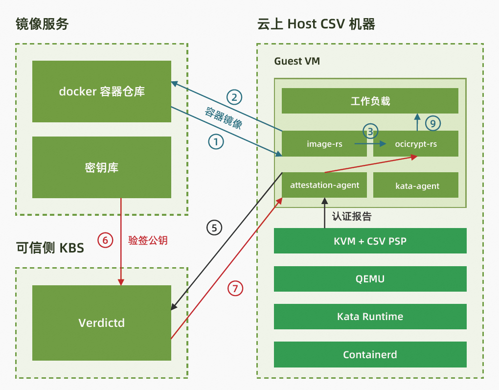

# 基于runtime-attestation使用签名容器

本文主要为您介绍如何在kata环境中基于海光安全加密虚拟化功能CSV(China Secure Virtualization)技术，启动一个租户的签名容器镜像。

## 前提条件

请参考《基于runtime-attestation使用机密容器》指南的前提条件一节，完成对系统环境的检查和配置。

## 背景信息



相较于Confidential Container v0，Confidential Container v1增加支持镜像签名和验签，并使用image-rs取代umoci和skopeo来完成镜像的相关管理功能。更多相关信息，请参考[ccv1_image_security_design](https://github.com/confidential-containers/image-rs/blob/main/docs/ccv1_image_security_design.md) 。

①②③：containerd 调用 kata-runtime 启动 CSV VM；kata-runtime调用 image-rs 下载加密镜像；

④：attestation-agent 通过 vm-attestation hypercall 获取包括 attestation-report 、chip-id 等内容的 CSV VM evidence；

⑤：attestation-agent 发送 CSV VM evidence 给 verdictd server；verdictd 验证 CSV VM evidence 的证书链、签名、digest 等内容；与 attestation-agent 建立基于 rats-tls 的可信硬件环境的安全通道； 

⑥⑦：attestation-agent 向verdictd server 请求验签 key和image policy，verdictd 作为 KBS 通过安全通道发送 policy 文件和验签key发送给 attestation-agent；

⑧：image-rs 使用 key 验签镜像；

⑨：启动镜像运行 workload

## 步骤一：配置权限

请参考《基于runtime-attestation使用机密容器》指南的步骤一，完成配置权限。

## 步骤二：制作签名的应用容器镜像

### 1. ⽣成GPG密钥对

GPG：GNU Privacy Guard ， 用于加密、签名通信内容及管理非对称密钥等。
这里假设用户名为 testing，邮箱为test@higon.cn，请按gpg2提示输入用户名、邮箱、密码等信息。

```
gpg2 --gen-key
```
上述执行完成后，执行 gpg2 --list-keys 列举生成的密钥：
可看见类似如下内容：

```
[root@localhost test]# gpg2 --list-keys
/root/.gnupg/pubring.kbx
------------------------
pub   rsa2048 2022-05-11 [SC] [expires: 2024-05-10]
      B0801A210472A10CC22090C8B27A004C4E80D3E5
uid           [ultimate] testing <test@hygon.cn>
sub   rsa2048 2022-05-11 [E] [expires: 2024-05-10]
```

由于verdictd不支持kbx格式pubkey，还需执行如下操作生成pubring.gpg

```
cd /root/.gnupg/
gpg2 --armor --export --output pubring.gpg test@hygon.cn
```

### 2. 制作签名的应用容器镜像

以docker.io/library/busybox:latest这个镜像为例，假设用户名为test，则远端的个⼈仓库为docker.io/test/busybox。

> 注意：在实际操作中，应将docker.io/test更名为实际操作的用户名，docker.io/xxxx。

⾸先配置 /etc/containers/registries.d/default.yaml ⽂件内容如下:  

```
default-docker:
 sigstore-staging: file:///var/lib/containers/sigstore
```

然后⽤skopeo copy --sign-by进⾏签名，
以用户test为例：执行成功后在[https://hub.docker.com/r/test/busybox/tags](https://hub.docker.com/r/bugkeeper/busybox/tags) 上可观察到sig-test的tag。

```
skopeo login docker.io --username <$username> --password <$password>

skopeo copy --remove-signatures --sign-by test@hygon.cn \
 docker://docker.io/library/busybox:latest \
 docker://docker.io/test/busybox:sig-test
 
skopeo logout docker.io/test
```

以用户test为例：在本地可观察到 /var/lib/containers/sigstore ⽬录下多出了test⽬录（这样就完成了签名的准备⼯作）：  

```
tree /var/lib/containers/sigstore

/var/lib/containers/sigstore
└── test
    └── busybox@sha256=52f431d980baa76878329b68ddb69cb124c25efa6e206d8b0bd797a828f0528e
        └── signature-1

```

## 步骤三：安装kata 环境

请参考《基于runtime-attestation使用机密容器》指南的步骤二来安装kata环境，并参考以下步骤更新initrd文件和kata 配置文件。

### 更新initrd文件

#### 解压initrd image

```
cp initrd.run.img ./initrd.img.gz
gunzip initrd.img.gz
mkdir initrd
cd initrd/
cpio -ivmd < ../initrd.img
```

#### 配置待验证镜像签名⽂件  

将 /var/lib/containers/sigstore ⽬录下的所有内容 复制到initrd/var/lib/containers/sigstore：

```
sudo cp -rf /var/lib/containers/sigstore/* initrd/var/lib/containers/sigstore
```

#### 重新打包initrd

```sh
cd initrd/
find . | cpio -o -H newc > ../initrd.new.img
gzip ../initrd.new.img
cd ../ && mv initrd.new.img.gz initrd.new.img
cp initrd.new.img initrd.run.img
```

## 步骤四：安装containerd

请参考《基于runtime-attestation使用机密容器》指南的步骤三来安装containerd。

## 步骤五：搭建kubenetes运行环境

请参考《基于runtime-attestation使用机密容器》指南的步骤四来搭建kubenetes运行环境。


## 步骤六： 安装并启动Verdictd  

Verdictd是一种远程认证实现，由一组构建块组成，这些构建块利用Intel/AMD的安全特性来发现、验证和支持关键的基础安全和机密计算用例。它依靠RATS-TLS应用远程认证基础和标准规范来维护平台数据收集服务和高效的验证引擎来执行全面的信任评估。这些信任评估可用于管理应用于任何给定工作负载的不同信任和安全策略。 更多信息请参考[verdictd](https://github.com/inclavare-containers/verdictd)项目文档。

### 1. 安装verdicted

```sh
yum remove verdictd -y
rm -rf /usr/share/rats-tls /usr/local/lib/rats-tls/ /usr/local/bin/verdict*
yum install -y verdictd
```

### 2. 配置verdictd

#### 2.1 将步骤二中的pubring.gpg复制到 /opt/verdictd/gpg/ 

```
cp /root/.gnupg/pubring.gpg  /opt/verdictd/gpg/keyring.gpg
```

#### 2.2 将policy.json写入到 /opt/verdictd/image/ 

> 在实际操作中，应将用户docker.io/test更名为实际操作的docker.io用户名，docker.io/xxxx。


```

cat>/opt/verdictd/image/policy.json <<EOF
{
  "default": [
   {
      "type": "reject"
   }
 ],
  "transports": {
    "docker": {
      "docker.io/test": [
       {
          "type": "signedBy",
          "keyType": "GPGKeys",
          "keyPath": "/run/image-security/simple_signing/pubkey.gpg"
       }
     ]
   }
 }
}
EOF
```

#### 2.3 将sigstore.yaml写入到 /opt/verdictd/image/ 

```
cat>/opt/verdictd/image/sigstore.yaml <<EOF
default-docker:
 sigstore: file:///var/lib/containers/sigstore

docker:
 docker.io/test:
   sigstore: file:///var/lib/containers/sigstore
EOF
```

#### 2.4 配置CSV OPA文件
使用/opt/csv/calculate_hash.py计算measure：
```sh
yum install -y gop
/opt/csv/calculate_hash.py --ovmf  /opt/csv/ccv0-guest/OVMF.fd --kernel /opt/csv/ccv0-guest/vmlinuz-5.15.0-rc5+  --initrd /opt/csv/ccv0-guest/initrd.run.img --cmdline /opt/csv/ccv0-guest/cmdline
```

输出结果类似如下：
```sh
Calculating hash of kernel at /opt/csv/ccv0-guest/vmlinuz-5.15.0-rc5+
Calculating hash of initrd at /opt/csv/ccv0-guest/initrd.run.img
Calculating hash of kernel params (/opt/csv/ccv0-guest/cmdline)
Firmware Digest:  OJXIhq3PHbknNmpAIy8YpUHOpY0wvGRXULOW8djVAZA=
```

配置csvData，需确保csvData中的measure与前一步计算的Firmware Digest一致。
```sh
mkdir -p /opt/verdictd/opa/ && cat <<EOF | sudo tee /opt/verdictd/opa/csvData
{
    "measure": ["OJXIhq3PHbknNmpAIy8YpUHOpY0wvGRXULOW8djVAZA="]
}
EOF
```

配置csvPolicy.rego：
```sh
cat <<EOF | sudo tee /opt/verdictd/opa/csvPolicy.rego

package policy

# By default, deny requests.
default allow = false

allow {
    measure_is_grant
}


measure_is_grant {
    count(data.measure) == 0
}

measure_is_grant {
    count(data.measure) > 0
    input.measure == data.measure[_]
}
EOF
```

### 3. 启动verdictd

使用以下命令启动verdictd，从而于Attestation-Agent建立基于CSV的安全信道。
```sh
verdictd --listen 0.0.0.0:20002 --verifier csv --attester nullattester --client-api 127.0.0.1:20001 --mutual
```

**注意**：verdictd 启动的时候有一个报错。原因是在注册SGX相关的 instance时出错，在CSV平台上可以忽略。

```sh
[ERROR] failed on dlopen(): libsgx_dcap_quoteverify.so.1: cannot open shared object file: No such file or directory
```

## 步骤七：启动并验证带签名的镜像

### 1. 创建RuntimeClass对象kata
用户可以使用RuntimeClass为pod指定不同的运行时，这里使用kata作为验证时使用的运行时。
在集群中执行以下命令，创建RuntimeClass对象kata。

```
cat <<-EOF | kubectl apply -f -
apiVersion: node.k8s.io/v1
kind: RuntimeClass
metadata:
  name: kata
handler: kata
EOF
```

### 2. 部署pod

如果 pod 的 runtimeClassName 设置为 kata，CRI 插件会使用 Kata Containers 运行时运行 pod。 执行以下命令，部署名称为sig-test的pod。
> 注意：在实际操作中，应将用户docker.io/test更名为实际操作的用户名，docker.io/xxxx。

```
cat <<-EOF | kubectl apply -f -
apiVersion: v1
kind: Pod
metadata:
  name: sig-test
spec:
  runtimeClassName: kata
  containers:
  - image: docker.io/test/busybox:sig-test
    command:
      - top
    imagePullPolicy: IfNotPresent
    name: csv-sig-test
  restartPolicy: Never
EOF
```

### 3. 测试签名镜像是否部署成功

执行以下命令，查看加密镜像是否部署成功：

```
kubectl get pods 
```

预期输出类似如下：

```
NAME       READY   STATUS    RESTARTS   AGE
sig-test   1/1     Running   0          23s
```

