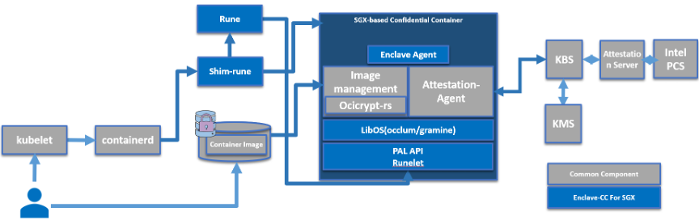

# Enclave-CC: 进程级机密容器

## 项目位置链接

https://github.com/confidential-containers/enclave-cc

## 项目归属SIG

云原生机密计算SIG

## 技术自身介绍

### 背景

数据在整个生命周期有三种状态：At-Rest（静态）、In-Transit（传输中）和 In-Use（使用中）。在这个世界上，我们不断地存储、使用和共享各种敏感数据。保护处于所有状态中的敏感数据比以往任何时候都更为重要。如今被广泛使用的加密技术可以用来提供数据机密性（防止未经授权的访问）和数据完整性（防止或检测未经授权的修改），但目前这些技术主要被用于保护传输中和静止状态的数据，对数据的第三个状态“使用中”提供安全防护的技术仍旧属于新的前沿领域。Enclave-CC全链路安全（从部署到运行）方案能够解决用户在传输和使用中的安全， 有助于促进安全敏感度高的用户从私有部署迁移到公有云上。

### 问题&挑战

机密容器在部署阶段， 需要从租户侧部署到云端，在这个过程中，不能保证用户的镜像是机密的， 意味着承载用户应用的容器镜像是不安全的， 在上传到第三方的image registry有被第三方窥探的风险， 并不能保证镜像内容的安全。 而且需要针对于不同的enclave runtime制作特定的镜像。 这些操作都会对普通用户造成额外的开发负担。

### 解决方案

Enclave-cc方案在部署阶段对用户的镜像进行加密和签名处理， 从而保证镜像的安全性和完整性， 防止在被第三方窥探和修改镜像的内容。 在生成容器镜像的时候， 用户只需要和制作普通容器镜像一样，不需要针对特定的libos做额外定制， 对于支持POSIX API的应用， 可以完全兼容的通过enclave-cc成功运行起来。

Enclave-cc方案的运行流程如下：

- 1、用户使用标准工具制作一个签名和/或加密的受保护的容器镜像，并上传到容器镜像仓库中。
- 2、用户命令 Kubernetes 启动这个受保护的容器镜像。kubelet 会向 containerd 发起创建 Pod 的 CRI 请求，containerd 则把请求转发给 shim-rune，最终调用 rune 创建实际的 Pod。
- 3、CPU TEE 执行初始化，最终启动 enclave-agent 监听后续请求。
- 4、kubelet 向 containerd 发起 Image Pulling 的 CRI 请求，containerd 则把请求转发给 shim-rune，最终 enclave-agent 收到请求并通过 image-rs 子模块提供的容器镜像管理功能，在 TEE 内安全地执行拉取、验签、解密、unpack 以及挂载容器镜像的操作。
- 5、如果 TEE 内没有预先在 boot image 中内置验签或解密容器镜像的相关策略文件或密钥，则 image-rs 子模块会请求 attestation-agent 组件通过远程证明协议与远端可信的远程证明服务进行基于CPU TEE 硬件的身份认证与授权，通过attestation-agent 与远程证明服务建立的安全可信信道返回 image-rs 子模块需要的敏感数据。
- 6、远程证明服务验证 CPU TEE 硬件认证证据的完整性和真实性。起到比较验证作用的可信参考值由机密计算软件供应链安全基础设施来下发。如果 CPU TEE 通过了身份认证，远程证明服务将授权密钥管理服务（KMS）返回 attestation-agent 请求的敏感数据，比如容器镜像的解密密钥和加密引导过程中用到的磁盘解密密钥。

Enclave-cc为云原生用户提供了一种机密容器的部署和运行方案。 能够让用户在使用机密容器的时候具有和使用普通容器一样的体感， 用户不需要针对于机密容器的场景修改应用, 在部署的时候不需要额外的操作步骤。

