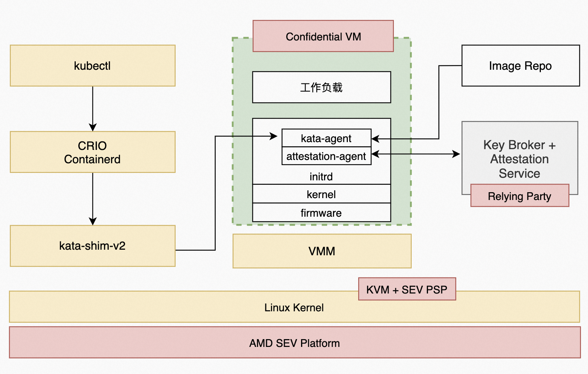

# AMD SEV机密容器

本文主要为您介绍如何基于AMD安全加密虚拟化功能SEV([AMD Secure Encrypted Virtualization](https://developer.amd.com/sev/))技术，通过远程证明启动一个租户的加密容器镜像。

## 前提条件

### 1. 安装Anolis 8.6 操作系统

请在**支持AMD CPU的硬件设备**上，参考[Anolis 8.6 GA说明文档](https://mirrors.openanolis.cn/anolis/8.6/isos/GA/)安装anolis 8.6 GA。

### 2. 升级内核到5.10

由于 Anlois 8.6 的默认内核版本是4.19，请升级kernel 到5.10版本。

- 添加 yum 源配置参数，添加Anolis 的 Experimental repo。

```shell
yum install yum-utils
yum-config-manager --add-repo https://mirrors.openanolis.cn/anolis/8/kernel-5.10/x86_64/os/
```

- 升级内核

```shell
yum update kernel
```

- 重启机器，并重新查看机器的操作系统发行编号。

```shell
reboot
uname -r
```

- 预期结果如下：

```shell
5.10.134-13_rc2.an8.x86_64
```

### 3. 使能SEV

**注意：**在 Anolis 8.6 中，grub 版本默认为1:2.02-123.0.2.an8_6.8。此版本存在BUG，如果直接进行使能sev的操作，会导致机器重启后无法进入系统的情况。请采用降级grub的workround方法。

- 修改 yum 源，在 Anolis 8.5 中才有低版本的 grub。

```shell
cd /etc/yum.repos.d
sed -i 's/$releasever/8.5/' AnolisOS-BaseOS.repo
```

- 降级 grub。

```shell
yum downgrade grub2-efi
```

- 查看 grub 的版本，预期结果如下：

```shell
# yum list | grep grub
grub2-common.noarch                  1:2.02-106.0.1.an8              @BaseOS
grub2-efi-x64.x86_64                 1:2.02-106.0.1.an8              @BaseOS
grub2-pc.x86_64                      1:2.02-106.0.1.an8              @BaseOS
grub2-pc-modules.noarch              1:2.02-106.0.1.an8              @BaseOS
grub2-tools.x86_64                   1:2.02-106.0.1.an8              @BaseOS
grub2-tools-efi.x86_64               1:2.02-106.0.1.an8              @BaseOS
grub2-tools-extra.x86_64             1:2.02-106.0.1.an8              @BaseOS
grub2-tools-minimal.x86_64           1:2.02-106.0.1.an8              @BaseOS
```

#### 使能SEV和SME

默认情况下SEV和SME没有使能，请输入以下内核命令行进行使能：

```shell
grubby --update-kernel=ALL --args="mem_encrypt=on kvm_amd.sev=1"
```

重启机器。

```shell
reboot
```

重启后，请检查机器的sev使能状态。

```shell
dmesg | grep -i sev 
```

预期结果如下：

```shell
[    6.747923] ccp 0000:4b:00.1: sev enabled
[    6.842676] ccp 0000:4b:00.1: SEV firmware update successful
[    6.997400] ccp 0000:4b:00.1: SEV API:1.42 build:42
[    7.522437] SEV supported: 255 ASIDs
```

最后检查 SME(Secure Memory Encryption) 的状态。

```shell
dmesg | grep -i sme
```

预期结果如下：

```shell
[    1.863927] AMD Memory Encryption Features active: SME
```

## 背景信息



AMD SEV Pod 级机密容器架构基于 Kata Containers 项目，最大区别是将基于普通虚拟化技术实现的轻量级 Sandbox Pod替换为基于机密计算技术实现的轻量级 TEE Pod，目的是将特定租户的整个 Pod 以及其中的容器运行在受 CPU TEE 保护的执行环境中。除此之外，TEE Pod 内部还额外集成了 image-rs 和 attestation-agent 等组件，它们负责实现容器镜像的拉取、授权、验签、解密、远程证明以及秘密注入等安全特性。
机密容器的基本运行过程为：

- 用户使用标准工具制作一个签名和/或加密的受保护的容器镜像，并上传到容器镜像仓库中。
- 用户命令 Kubernetes 启动这个受保护的容器镜像。kubelet 会向 containerd 发起创建 Pod 的 CRI 请求，containerd 则把请求转发给 kata-runtime。
- kata runtime 与 Key broker service（simple kbs）建立安全会话，并进行基于CPU TEE 硬件的身份认证与授权。KBS基于安全可信信道发送敏感数据给kata runtime。kata runtime 调用QEMU 将秘密信息注入到guest userland中。之后再调用 QEMU 启动 Pod。
- CPU TEE 执行初始化，最终启动 kata-agent 监听后续请求。
- kubelet 向 containerd 发起 Image Pulling 的 CRI 请求，containerd 则把请求转发给 kata-runtime，最终 kata-agent 收到请求并通过 image-rs 子模块提供的容器镜像管理功能，在 TEE 内安全地执行拉取、验签、解密、unpack 以及挂载容器镜像的操作。

## 步骤一：部署测试集群

本步骤为您提供快速部署**单节点测试集群**的步骤。您可以根据您的需求，灵活部署集群。

### 配置权限

#### 关闭firewall

Linux系统下面自带了防火墙 iptables ，iptables 可以设置很多安全规则。但是如果配置错误很容易导致各种网络问题。此处建议关闭 firewall 。 执行如下操作：

```shell
sudo service firewalld stop
```

检查 firewall 状态：

```shell
service firewalld status
```

预期结果如下：

```shell
Redirecting to /bin/systemctl status firewalld.service
● firewalld.service - firewalld - dynamic firewall daemon
   Loaded: loaded (/usr/lib/systemd/system/firewalld.service; disabled; vendor preset: enabled)
   Active: inactive (dead)
     Docs: man:firewalld(1)
```

#### 关闭selinux

Security-Enhanced Linux（SELinux）是一个在内核中实施的强制存取控制（MAC）安全性机制。为避免出现权限控制导致的虚拟机启动、访问失败等问题，此处建议关闭selinux。执行如下操作：

```shell
setenforce 0
```

预期结果如下：

```shell
setenforce: SELinux is disabled
```

### 安装operator-sdk

operator SDK 项目是 Operator Framework 的一个组件，Operator Framework 是一个开源工具包，用于以有效、自动化和可扩展的方式管理 Kubernetes 原生应用程序，称为 Operators。具体信息，请参考[operator SDK](https://sdk.operatorframework.io/)。

```shell
wget -O /usr/local/bin/operator-sdk https://github.com/operator-framework/operator-sdk/releases/download/v1.23.0/operator-sdk_linux_amd64
sudo chmod +x /usr/local/bin/operator-sdk
```

### 启动本地 docker registry

- 请执行下列脚本安装 docker。

```shell
yum-config-manager --add-repo https://download.docker.com/linux/centos/docker-ce.repo
yum install -y containerd.io docker-ce docker-ce-cli
systemctl start docker.service
```

- 执行如下命令，启动本地 docker registry，该registry 用于存储operator images。

```shell
docker run -itd -p 5000:5000 docker.io/library/registry:latest
```

检查 docker 容器是否启动成功：

```shell
docker ps
```

预期结果如下，注意，状态（STATUS）应该是Up的。

```shell
CONTAINER ID  IMAGE            COMMAND                 CREATED         STATUS         PORTS                                      NAMES
a7cc49ee1d19  registry:latest  "/entrypoint.sh /etc…"  38 minutes ago  Up 38 minutes  0.0.0.0:5000->5000/tcp, :::5000->5000/tcp  nostalgic_montalcini
```

### 配置containerd

自动生成默认的config.toml

```shell
containerd config default > /etc/containerd/config.toml
```

由于默认的 config.toml 使用的是国外的镜像，国内有可能无法访问。请参考以下命令修改为国内镜像。

```shell
cd /etc/containerd
sed -i 's#registry.k8s.io/pause:3.6#registry.cn-hangzhou.aliyuncs.com/google_containers/pause:3.1#g' config.toml
```

启动 containerd

```shell
systemctl containerd start
```

### 部署单节点的Kubernetes cluster

- 请参考[kubernetes](https://github.com/kubernetes/kubernetes)官方指南安装Kubernetes cluster。最低 Kubernetes 版本应为 1.24。
- 确保集群中至少有一个 Kubernetes 节点具有标签 node-role.kubernetes.io/worker=

```shell
kubectl label node <node-name> node-role.kubernetes.io/worker=
```

## 步骤二：安装Confidential computing Operator

Confidential computing Operator 提供了一种在 Kubernetes 集群上部署和管理 Confidential Containers Runtime 的方法。具体信息请参考[指南](https://github.com/confidential-containers/operator)。

### 前提条件

1. 确保 Kubernetes 集群节点至少有 8GB RAM 和 4 个 vCPU
2. 当前 CoCo 版本仅支持基于 containerd 运行时的 Kubernetes 集群
3. 确保 SELinux 被禁用或未强制执行 ([confidential-containers/operator#115](https://github.com/confidential-containers/operator/issues/115))

### 部署Operator

Operator目前有3个[版本](https://github.com/confidential-containers/operator/tags)，这里默认安装最新版v0.3.0版本。
通过运行以下命令部署Operator：

```shell
kubectl apply -k github.com/confidential-containers/operator/config/release?ref=v0.3.0
```

cc-operator-controller-manager 资源依赖国外的镜像，可能拉不下来，请参考以下步骤对镜像进行修改：

```shell
kubectl edit deploy cc-operator-controller-manager -n confidential-containers-system

# 将gcr.io/kubebuilder/kube-rbac-proxy:v0.13.0替换成
image: quay.io/brancz/kube-rbac-proxy:v0.13.0
```

查看节点状态：

```shell
kubectl get pods -n confidential-containers-system --watch
```

预期结果如下。注意这三个pod都要存在，且STATUS都要为Running。

```shell
NAME                                              READY   STATUS    RESTARTS   AGE
cc-operator-controller-manager-56cb4d5ff5-lqd9x   2/2     Running   0          167m
cc-operator-daemon-install-rg8s9                  1/1     Running   0          154m
cc-operator-pre-install-daemon-7jhnw              1/1     Running   0          154m
```

### 创建custom resource

创建 custom resource 会将所需的 CC runtime安装到集群节点中并创建 RuntimeClasses。操作如下：

```shell
kubectl apply -k github.com/confidential-containers/operator/config/samples/ccruntime/default?ref=v0.3.0
```

检查创建的 RuntimeClasses。

```shell
kubectl get runtimeclass
```

预期结果如下：

```shell
NAME            HANDLER         AGE
kata            kata            154m
kata-clh        kata-clh        154m
kata-clh-tdx    kata-clh-tdx    154m
kata-qemu       kata-qemu       154m
kata-qemu-sev   kata-qemu-sev   154m
kata-qemu-tdx   kata-qemu-tdx   154m
```

### 卸载Operator（非必要步骤）

如果您想更新Operator的版本，或者您的安装出现问题，可以先卸载，再回到上面的步骤重新安装。具体操作请参考[链接](https://github.com/confidential-containers/operator/blob/main/docs/INSTALL.md#uninstallation)。

```shell
kubectl delete -k github.com/confidential-containers/operator/config/samples/ccruntime/default?ref=<RELEASE_VERSION>
kubectl delete -k github.com/confidential-containers/operator/config/release?ref=${RELEASE_VERSION}
```

## 步骤三：启动Simple KBS

[simple kbs](https://github.com/confidential-containers/simple-kbs#readme)是一个密钥代理服务，可以存储并向 workload 提供 secret 。对于 SEV 加密容器示例来说，需要从simple kbs 中获取 secret ，并用于解密已加密的容器。
在步骤四的示例二中，本文提供了一个简单的加密镜像( docker.io/haosanzi/busybox-v1:encrypted )，该镜像使用 simple kbs 已经[存在的密钥](https://github.com/confidential-containers/simple-kbs/blob/main/db/initial-data.sql)来解密，同时对 policy 不进行校验。此加密镜像只作为测试使用，如您想用于自己的生产用例中，请参考[指南](https://github.com/confidential-containers/documentation/blob/main/quickstart.md#create-an-encrypted-image)制作一个新的加密镜像并部署。

要了解有关创建 policy 的更多信息，请参考[指南](https://github.com/confidential-containers/documentation/blob/main/quickstart.md#creating-a-simple-kbs-policy-to-verify-the-sev-firmware-measurement)。

- 安装 docker-compose 后，才能在 docker 容器中运行 simple-kbs 及其数据库，数据库中存放了 secret 等信息：

```shell
dnf install docker-compose-plugin
```

- 下载 simple-kbs 的代码：

```shell
simple_kbs_tag="0.1.1"
git clone https://github.com/confidential-containers/simple-kbs.git
cd simple-kbs && git checkout -b "branch_${simple_kbs_tag}" "${simple_kbs_tag}"
```

- 使用 docker-compose 运行 simple-kbs ：

```shell
cd simple-kbs 
sudo docker compose up -d
```

## 步骤四：运行workload

### 示例一：运行一个未加密的容器镜像

为了验证主机上不存在容器镜像，应该登录到 k8s 节点并确保以下命令返回空结果：

```shell
crictl  -r  unix:///run/containerd/containerd.sock image ls | grep bitnami/nginx
```

启动POD

```shell
cat <<-EOF | kubectl apply -f -
apiVersion: v1
kind: Pod
metadata:
  labels:
    run: nginx
  name: nginx
spec:
  containers:
  - image: bitnami/nginx:1.22.0
    name: nginx
  dnsPolicy: ClusterFirst
  runtimeClassName: kata
EOF
```

预期结果：

```shell
pod/nginx created
```

查看 pod 状态：

```shell
kubectl get pods
```

预期结果如下，注意， STATUS 要是 Running 。

```shell
NAME    READY   STATUS    RESTARTS   AGE
nginx   1/1     Running   0          3m50s
```

### 示例二：运行一个加密容器

attestation agent 支持两种SEV平台相关的KBC：[offline_sev_kbc](https://github.com/confidential-containers/attestation-agent/tree/main/src/kbc_modules/offline_sev_kbc) 和 [online_sev_kbc](https://github.com/confidential-containers/attestation-agent/tree/main/src/kbc_modules/online_sev_kbc)。

- offline sev KBC 在**运行时**不会与 Simple KBS 进行通信，而是使用在**VM Boot时期**通过QEMU注入的secret。该机制的缺点是对注入的 secret 长度有限制。
- online sev KBC 在offline sev KBC的基础上，支持在**运行时**发出请求。online sev KBC 在VM Boot时期通过QEMU注入connection。注入的connection包含一个对称密钥，用于加密和验证 KBC 发出的在线请求。 该连接受 SEV(-ES) 秘密注入过程保护，该过程提供机密性、完整性并防止重放攻击。 simple-kbs 为每个连接生成一个新的对称密钥。 KBC 要求每个在线secret都带有随机 guid 以防止重放攻击。

> 注意：[offline_sev_kbc](https://github.com/confidential-containers/attestation-agent/tree/main/src/kbc_modules/offline_sev_kbc) 和 [online_sev_kbc](https://github.com/confidential-containers/attestation-agent/tree/main/src/kbc_modules/online_sev_kbc) 是两种option，用户只需要采用一种KBC方式运行镜像即可。

#### 导出SEV证书链

sevctl 是 SEV 平台的命令行管理工具，Kata 机密容器需要 SEV 证书链从而与guest owner建立安全会话。请按照以下步骤安装 sevctl：

```shell
dnf install sevctl
```

SEV 证书链必须放在 /opt/sev 中，使用以下命令导出 SEV 证书链：

```shell
mkdir -p /opt/sev
sevctl export --full /opt/sev/cert_chain.cert
```

#### 基于online KBC运行机密容器

- 请下载支持online sev kbc 的 initrd：

```shell
wget https://mirrors.openanolis.cn/inclavare-containers/confidential-containers-demo/bin/ccv3-sev/initrd.run.online-sev.img -O /opt/confidential-containers/share/kata-containers/kata-containers-initrd-sev.img
```

- 自定义 policy ，请参考[附录部分](#附录)。
- 编辑 kata 配置文件：

```shell

kbs_ip="$(ip -o route get to 8.8.8.8 | sed -n 's/.*src \([0-9.]\+\).*/\1/p')"
sed -i 's/agent.enable_signature_verification=false /&agent.aa_kbc_params=online_sev_kbc::'$kbs_ip':44444/' /opt/confidential-containers/share/defaults/kata-containers/configuration-qemu-sev.toml
```

- 启动POD

```shell
cat <<-EOF | kubectl apply -f -
apiVersion: v1
kind: Pod
metadata:
  labels:
    run: test-en-online
  name: test-en-online
spec:
  containers:
  - image: docker.io/haosanzi/busybox-v1:encrypted
    name: test-en-online
    imagePullPolicy: Always
  dnsPolicy: ClusterFirst
  restartPolicy: Never
  runtimeClassName: kata-qemu-sev
EOF
```

- 查看 pod 是否启动成功：

```shell
kubectl get po
```

- 预期结果如下：

```shell
NAME                READY   STATUS    RESTARTS   AGE
test-en-online      1/1     Running   0          146m
```

#### 基于offline KBC运行加密容器

- 请下载支持offline KBC的initrd。

```shell
wget https://mirrors.openanolis.cn/inclavare-containers/confidential-containers-demo/bin/ccv3-sev/initrd.run.offline-sev.img -O /opt/confidential-containers/share/kata-containers/kata-containers-initrd-sev.img
```

- 编辑 kata 配置文件：

```shell
cd /opt/confidential-containers/share/defaults/kata-containers
sed -i 's/1ee27366-0c87-43a6-af48-28543eaf7cb0/e6f5a162-d67f-4750-a67c-5d065f2a9910/' configuration-qemu-sev.toml
sed -i 's/connection/bundle/' configuration-qemu-sev.toml
```

- 自定义 policy ，请参考[附录部分](#附录)。
- 启动 Pod

```shell
cat <<-EOF | kubectl apply -f -
apiVersion: v1
kind: Pod
metadata:
  labels:
    run: test-en-offline
  name: test-en-offline
spec:
  containers:
  - image: docker.io/haosanzi/busybox-v1:encrypted
    name: test-en-offline
    imagePullPolicy: Always
  dnsPolicy: ClusterFirst
  restartPolicy: Never
  runtimeClassName: kata-qemu-sev
EOF
```

- 查看 pod 是否启动成功：

```shell
kubectl get po
```

- 预期结果如下：

```shell
NAME                READY   STATUS    RESTARTS   AGE
test-en-offline     1/1     Running   0          31h
```

## 附录

### 制作一个新的加密镜像并部署

请参考[指南](https://github.com/confidential-containers/documentation/blob/main/quickstart.md#create-an-encrypted-image)制作一个新的加密镜像并部署。

### 自定义simpel KBS 的policy 

- [sev-snp-measure](https://github.com/IBM/sev-snp-measure)是一个实用程序，用于使用提供的 ovmf、initrd、kernel、cmdline等作为参数来计算 SEV guest固件测量值。下载sev-snp-measure：

```shell
git clone https://github.com/IBM/sev-snp-measure.git
cd sev-snp-measure
```

- 根据ovmf、kernel和initrd_path的地址设置参数。
   - ovmf、kernel和initrd_path的地址请参考kata 的配置文件
   - kata 的配置文件路径：/opt/confidential-containers/share/defaults/kata-containers/configuration-qemu-sev.toml。

```shell
ovmf_path="/opt/confidential-containers/share/ovmf/OVMF.fd"
kernel_path="/opt/confidential-containers/share/kata-containers/vmlinuz-sev.container"
initrd_path="/opt/confidential-containers/share/kata-containers/kata-containers-initrd.img"
```

- 计算内核的append值

```shell
duration=$((SECONDS+30))
set append

while [ $SECONDS -lt $duration ]; do
  qemu_process=$(ps aux | grep qemu | grep append || true)
  if [ -n "${qemu_process}" ]; then
    append=$(echo ${qemu_process} \
      | sed "s|.*-append \(.*$\)|\1|g" \
      | sed "s| -.*$||")
    break
  fi
  sleep 1
done

echo "${append}"
```

- 使用 sev-snp-measure 来计算 SEV guest 的Launch digest。

```shell
 measurement=$(./sev-snp-measure.py --mode=sev --output-format=base64 \
  --ovmf "${ovmf_path}" \
  --kernel "${kernel_path}" \
  --initrd "${initrd_path}" \
  --append "${append}" \
)
```

- 设置simple kbs 数据库参数

```shell
KBS_DB_USER="kbsuser"
KBS_DB_PW="kbspassword"
KBS_DB="simple_kbs"
KBS_DB_TYPE="mysql"
KBS_DB_HOST=$(docker network inspect simple-kbs_default \
  | jq -r '.[].Containers[] | select(.Name | test("simple-kbs[_-]db.*")).IPv4Address' \
  | sed "s|/.*$||g")
```

- 由于本文使用的加密镜像( docker.io/haosanzi/busybox-v1:encrypted )，是采用 simple kbs [已经存在的密钥](https://github.com/confidential-containers/simple-kbs/blob/main/db/initial-data.sql)来解密，该镜像的 enc_key 值如下。用户需要根据加密镜像按需设置enc_key。

```shell
enc_key=RcHGava52DPvj1uoIk/NVDYlwxi0A6yyIZ8ilhEX3X4=
```

- 将 自定义policy 注入 mysql 中。
   - policy的组成包括：digests、policies、api_major、api_minor、build_ids等信息。详情请参考[链接](https://github.com/confidential-containers/simple-kbs/blob/main/db/db-mysql.sql#L73)。
   - 我们以digests为例子，向用户展示如何注入自定义policy 。用户可以根据需求自定义Policy。

```shell
mysql -u${KBS_DB_USER} -p${KBS_DB_PW} -h ${KBS_DB_HOST} -D ${KBS_DB} <<EOF
  REPLACE INTO secrets VALUES (10, 'key_id1', '${enc_key}', 10);
  REPLACE INTO keysets VALUES (10, 'KEYSET-1', '["key_id1"]', 10);
  REPLACE INTO policy VALUES (10, '["${measurement}"]', '[]', 0, 0, '[]', now(), NULL, 1);
EOF
```
