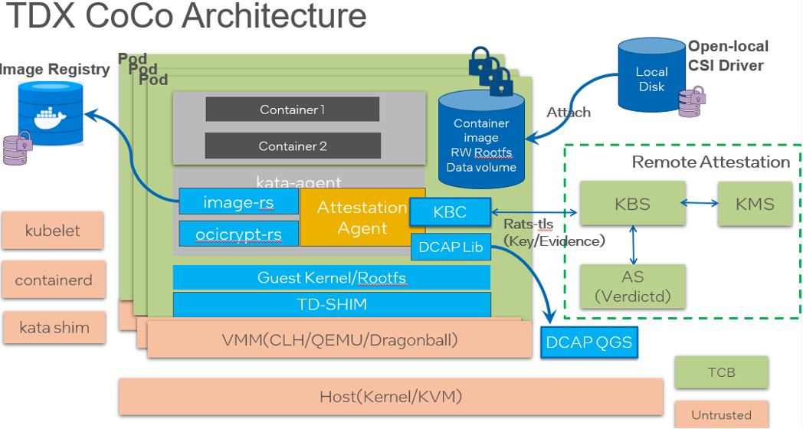

# Intel TDX机密容器

本文主要为您介绍如何基于Intel信任域(TD)的硬件隔离虚拟化功能TDX(Intel Trust Domain Extensions) （ https://www.intel.com/content/www/us/en/developer/articles/technical/intel-trust-domain-extensions.html ）技术，通过远程证明启动一个租户的加密签名容器镜像。

## 前提条件

### 1、安装Anolis 8.6 操作系统

请在支持INTEL TDX CPU的硬件设备上，参考[Anolis 8.6 GA说明文档](https://mirrors.openanolis.cn/anolis/8.6/isos/GA/)安装anolis 8.6 GA。

### 2、升级内核到5.10

由于 Anlois 8.6 的默认内核版本是4.19，请升级kernel 到5.10版本。

- 添加 yum 源配置参数，添加Anolis 的 Experimental repo。

```sh
yum install yum-utils
yum-config-manager --add-repo https://mirrors.openanolis.cn/anolis/8/kernel-5.10/x86_64/os/
```

- 升级内核

```sh
yum update kernel
```

- 重启机器，并重新查看机器的操作系统发行编号。

```sh
reboot
uname -r
```

- 预期结果如下：

```sh
5.10.134-13_rc2.an8.x86_64
```

### 3、使能TDX

- 重启后，请检查机器的tdx使能状态。

- 预期结果如下：

```sh
[    1.481148] seam: Loading TDX P-SEAMLDR intel-seam/np-seamldr.acm.
[    1.482177] seam: Successfully loaded TDX P-SEAMLDR.
[    1.482195] tdx: Build all system memory blocks as TDX memory.
[    5.919528] tdx: Loaded TDX module via P-SEAMLDR.
[    5.919763] tdx: TDX SEAM module: attributes 0x0 vendor_id 0x8086 build_date 20220420 build_num 0x156 minor_version 0x0 major_version 0x1.
[    6.379342] tdx: Successfully initialized TDX module
```

## 背景信息



英特尔 TDX Pod 级机密容器是将TDX硬件安全虚拟化技术同容器生态无缝集成，以云原生方式运行，保护敏感工作负载和数据的机密性和完整性。是目前机密容器社区（ https://github.com/confidential-containers ）主要支持的底层硬件之一。相对于传统基于虚拟机的容器技术，机密容器做了很多安全的增强，比如trusted boot, restricted API, encrypted/signed image, remote attestation，这些技术都集成为机密容器runtime stack的一部分。在TEE保护的guest 内部，默认集成了 image-rs 和 attestation-agent 等组件，它们负责实现容器镜像的拉取、授权、验签、解密、远程证明以及秘密注入等安全特性。机密容器的基本运行过程为：

- 用户使用标准工具制作一个签名和/或加密的受保护的容器镜像，并上传到容器镜像仓库中。

- 用户命令 Kubernetes 启动这个受保护的容器镜像。kubelet 会向 containerd 发起创建 Pod 的 CRI 请求，containerd 则把请求转发给 kata-runtime，kata-runtime 启动一个TDX 保护的轻量级VM, 目前支持TDX 的VMM 有Dragonball，Cloud Hypervisor, Qemu。

- kubelet 向 containerd 发起 Image Pulling 的 CRI 请求，containerd 则把请求转发给 kata-runtime，最终 kata-agent 收到请求并通过 image-rs 子模块提供的容器镜像管理功能，在下载image之前，image-rs会跟attestation-agent进行远程认证。

- Attestation-agent 与 Key broker service（verdictd）建立安全会话，并进行基于runtime stack启动过程中的度量值进行远程认证，确保runtime没有被篡改。只有通过远程认证，image解密key，签名的policy和证书才会传送到TEE保护的guest内部。

- 通过远程证明后，拿到image policy文件，签名证书，解密image key，image-rs进行验签、解密、unpack 以及挂载容器镜像的操作，最终顺利启动container。

## 步骤一：部署测试集群

本步骤为您提供快速部署单节点测试集群的步骤。您可以根据您的需求，灵活部署集群。

### 配置权限

#### 关闭firewall

Linux系统下面自带了防火墙 iptables ，iptables 可以设置很多安全规则。但是如果配置错误很容易导致各种网络问题。此处建议关闭 firewall 。 执行如下操作：

```sh
sudo service firewalld stop
```

检查 firewall 状态：

```sh
service firewalld status
```

预期结果如下：

```sh
Redirecting to /bin/systemctl status firewalld.service
● firewalld.service - firewalld - dynamic firewall daemon
   Loaded: loaded (/usr/lib/systemd/system/firewalld.service; disabled; vendor preset: enabled)
   Active: inactive (dead)
     Docs: man:firewalld(1)
```

#### 关闭selinux

Security-Enhanced Linux（SELinux）是一个在内核中实施的强制访问控制（MAC）安全性机制。为避免出现权限控制导致的虚拟机启动、访问失败等问题，此处建议关闭selinux。执行如下操作：

```sh
setenforce 0
```

预期结果如下：

```sh
setenforce: SELinux is disabled
```

### 配置containerd

自动生成默认的config.toml

```sh
containerd config default > /etc/containerd/config.toml
```

由于默认的 config.toml 使用的是国外的镜像，国内有可能无法访问。请参考以下命令修改为国内镜像。

```sh
cd /etc/containerd
sed -i 's#registry.k8s.io/pause:3.6#registry.cn-hangzhou.aliyuncs.com/google_containers/pause:3.1#g' config.toml
```

启动 containerd

```sh
systemctl containerd start
```

### 部署单节点的Kubernetes cluster

- 请参考[kubernetes](https://github.com/kubernetes/kubernetes)官方指南安装Kubernetes cluster。最低 Kubernetes 版本应为 1.24。
- 确保集群中至少有一个 Kubernetes 节点具有标签 node-role.kubernetes.io/worker=

```sh
kubectl label node <node-name> node-role.kubernetes.io/worker=
```

## 步骤二：安装Confidential computing Operator

Confidential computing Operator 提供了一种在 Kubernetes 集群上部署和管理 Confidential Containers Runtime 的方法。具体信息请参考[指南](https://github.com/confidential-containers/operator)。

### 前提条件

1、确保 Kubernetes 集群节点至少有 8GB RAM 和 4 个 vCPU

2、当前 CoCo 版本仅支持基于 containerd 运行时的 Kubernetes 集群

3、确保 SELinux 被禁用或未强制执行 (confidential-containers/operator#115)

### 部署Operator

Operator目前有3个[版本](https://github.com/confidential-containers/operator/tags)，这里默认安装最新版v0.3.0版本。 通过运行以下命令部署Operator：

```sh
kubectl apply -k github.com/confidential-containers/operator/config/release?ref=v0.3.0
```

cc-operator-controller-manager 资源依赖国外的镜像，可能拉不下来，请参考以下步骤对镜像进行修改：

```sh
kubectl edit deploy cc-operator-controller-manager -n confidential-containers-system

# 将gcr.io/kubebuilder/kube-rbac-proxy:v0.13.0替换成
image: quay.io/brancz/kube-rbac-proxy:v0.13.0
```

查看节点状态：

```sh
kubectl get pods -n confidential-containers-system --watch
```

预期结果如下。注意这三个pod都要存在，且STATUS都要为Running。

```sh
NAME                                              READY   STATUS    RESTARTS   AGE
cc-operator-controller-manager-56cb4d5ff5-lqd9x   2/2     Running   0          167m
cc-operator-daemon-install-rg8s9                  1/1     Running   0          154m
cc-operator-pre-install-daemon-7jhnw              1/1     Running   0          154m
```

### 创建custom resource

创建 custom resource 会将所需的 CC runtime安装到集群节点中并创建 RuntimeClasses。操作如下：

```sh
kubectl apply -k github.com/confidential-containers/operator/config/samples/ccruntime/default?ref=v0.3.0
```

检查创建的 RuntimeClasses。

```sh
kubectl get runtimeclass
```

预期结果如下：

```sh
NAME            HANDLER         AGE
kata            kata            154m
kata-clh        kata-clh        154m
kata-clh-tdx    kata-clh-tdx    154m
kata-qemu       kata-qemu       154m
kata-qemu-sev   kata-qemu-sev   154m
kata-qemu-tdx   kata-qemu-tdx   154m
```

### 卸载Operator（非必要步骤）

如果您想更新Operator的版本，或者您的安装出现问题，可以先卸载，再回到上面的步骤重新安装。具体操作请参考[链接](https://github.com/confidential-containers/operator/blob/main/docs/INSTALL.md#uninstallation)。

```sh
kubectl delete -k github.com/confidential-containers/operator/config/samples/ccruntime/default?ref=<RELEASE_VERSION>
kubectl delete -k github.com/confidential-containers/operator/config/release?ref=${RELEASE_VERSION}
```

## 步骤三：安装并启动verdictd

Verdictd是一种远程认证实现，由一组构建块组成，这些构建块利用Intel/AMD的安全特性来发现、验证和支持关键的基础安全和机密计算用例。它依靠RATS-TLS应用远程认证基础和标准规范来维护平台数据收集服务和高效的验证引擎来执行全面的信任评估。这些信任评估可用于管理应用于任何给定工作负载的不同信任和安全策略。 更多信息请参考[verdictd](https://github.com/inclavare-containers/verdictd)项目文档。

### 1. 请执行以下命令，安装verdictd

```sh
yum install -y verdictd
```

### 2. 部署镜像加密密钥

```sh
mkdir -p /opt/verdictd/keys/ 

cat <<- EOF > /opt/verdictd/keys/84688df7-2c0c-40fa-956b-29d8e74d16c0
1234567890123456789012345678901
EOF

```
### 3. 部署镜像签名密钥

```sh
# 安装镜像签名工具cosign: https://github.com/sigstore/cosign#installation
wget https://github.com/sigstore/cosign/releases/download/v2.0.0/cosign-linux-amd64
sudo install -D --owner root --group root --mode 0755 cosign-linux-amd64 /usr/local/bin/cosign

# 生成新的密钥对
cosign generate-key-pair
ls
cosign.key  cosign.pub
mkdir -p /opt/verdictd/image/
cp cosign.pub /opt/verdictd/image/cosign.key
```

### 4. 部署镜像policy

> 注意：在实际操作中，应将用户docker.io/test更名为实际操作的用户名，docker.io/xxxx。

```sh
cat <<EOF | sudo tee /opt/verdictd/image/policy.json
{
    "default": [
        {
            "type": " insecureAcceptAnything"
        }
    ],
    "transports": {
        "docker": {
            " docker.io/test/": [
                {
                    "type": "sigstoreSigned",
                    "keyPath": "/run/image-security/cosign/cosign.pub"
                }
            ]
        }
    }
}
EOF
```

### 5. 启动verdictd

```sh
verdictd --listen 0.0.0.0:20002 --verifier tdx --attester nullattester --client-api 127.0.0.1:20001 --mutual
```

当Verdictd启动后，Verdictd在端口监听地址0.0.0.0:20002监听来自attestation agent的远程证明请求。

### 6. 制作加密image

可参考[Generate encrypted container image](https://github.com/inclavare-containers/verdictd#generate-encrypted-container-image)制作加密镜像。 

注意事项：在机密计算场景中，加密镜像是在guest VM中由imgae-rs 组件负责拉取，而不是在host进行拉取。 如果您出于研究的目的，想查看加密镜像的内容。请注意**由于镜像是加密的，用常规的`docker`，`ctr` 和 `crictl` 都无法正常拉取。请使用`skopeo`工具进行镜像的拉取**。参考命令如下：

```sh
# 下载一个明文image
skopeo copy docker://docker.io/library/alpine:latest oci:alpine

# 为skopeo生成一个keyprovider配置文件
$ sudo mkdir -p /etc/containerd/ocicrypt/
$ cat <<- EOF | sudo tee "/etc/containerd/ocicrypt/ocicrypt_keyprovider.conf"
{
        "key-providers": {
                "attestation-agent": {
                    "grpc": "127.0.0.1:20001"

                }
        }
}
EOF

export OCICRYPT_KEYPROVIDER_CONFIG=/etc/containerd/ocicrypt/ocicrypt_keyprovider.conf

# 生成加密image并保存在远端docker registry
```

> 注意：在实际操作中，应将用户docker.io/test更名为实际操作的用户名，docker.io/xxxx。

```sh
skopeo copy --encryption-key provider:attestation-agent:84688df7-2c0c-40fa-956b-29d8e74d16c0 oci:alpine docker://docker.io/test/alpine-encrypted
{map[attestation-agent:{<nil> 127.0.0.1:50001}]}
&{map[attestation-agent:{<nil> 127.0.0.1:50001}]}
[[97 116 116 101 115 116 97 116 105 111 110 45 97 103 101 110 116 58 56 52 54 56 56 100 102 55 45 50 99 48 99 45 52 48 102 97 45 57 53 54 98 45 50 57 100 56 101 55 52 100 49 54 99 48]]
attestation-agent:84688df7-2c0c-40fa-956b-29d8e74d16c0
idx:  17
map[attestation-agent:[[56 52 54 56 56 100 102 55 45 50 99 48 99 45 52 48 102 97 45 57 53 54 98 45 50 57 100 56 101 55 52 100 49 54 99 48]]]
Getting image source signatures
&{map[attestation-agent:[[56 52 54 56 56 100 102 55 45 50 99 48 99 45 52 48 102 97 45 57 53 54 98 45 50 57 100 56 101 55 52 100 49 54 99 48]]] {map[]}}
Copying blob 63b65145d645 done
Copying config 6a2bcc1c7b done
Writing manifest to image destination
Storing signatures

# verdictd 日志
[2023-02-27T06:02:18Z INFO  verdictd::client_api::key_provider] wrap_command: KeyProviderInput { op: "keywrap", keywrapparams: KeyWrapParams { ec: Some(Ec { Parameters: {"attestation-agent": ["ODQ2ODhkZjctMmMwYy00MGZhLTk1NmItMjlkOGU3NGQxNmMw"]}, DecryptConfig: Dc { Parameters: {} } }), optsdata: Some("eyJzeW1rZXkiOiIycEVxWk9jNVhyUmN0WXdyQzl1UlJmSkZ5WGM2ZnV2SWZUckhnMHEyM0RrPSIsImRpZ2VzdCI6InNoYTI1Njo2M2I2NTE0NWQ2NDVjMTI1MGMzOTFiMmQxNmViZTUzYjM3NDdjMjk1Y2E4YmEyZmNiNmIwY2YwNjRhNGRjMjFjIiwiY2lwaGVyb3B0aW9ucyI6eyJub25jZSI6IkNURk5UZ2hZL0pkRkd0eGNKYzc5dUE9PSJ9fQ==") }, keyunwrapparams: KeyUnwrapParams { dc: None, annotation: None } }
[2023-02-27T06:02:18Z INFO  verdictd::resources::directory_key_manager] get key from keyFile: /opt/verdictd/keys/84688df7-2c0c-40fa-956b-29d8e74d16c0
[2023-02-27T06:02:18Z INFO  verdictd::client_api::key_provider] key: [49, 50, 51, 52, 53, 54, 55, 56, 57, 48, 49, 50, 51, 52, 53, 54, 55, 56, 57, 48, 49, 50, 51, 52, 53, 54, 55, 56, 57, 48, 49, 10]

```

### 7. 制作签名image

```sh
# 下载一个明文image
cosign sign --key cosign.key docker.io/test/alpine-encrypted
tlog entry created with index: 14409560
Pushing signature to: docker.io/test/alpine-encrypted
```

## 步骤四：启动并验证带签名的加密镜像

### 1.	配置TDX CoCo runtime

attestation agent 支持TDX平台的KBC为：eaa_kbc ， 远端verdictd service用于提供验证和image解密key，签名的policy和密钥信息。

```sh
vim /opt/confidential-containers/share/defaults/kata-containers/configuration-qemu-tdx.toml
# EAA KBC is specified as: eaa_kbc::host_ip:port
kernel_params = "<default kernel params> agent.aa_kbc_params=eaa_kbc::verdictd_ip_address:20002 agent.enable_signature_verification=true"
```

### 2.	部署Pod

> 注意：在实际操作中，应将用户docker.io/test更名为实际操作的用户名，docker.io/xxxx。

```sh
cat <<-EOF | kubectl apply -f -
apiVersion: v1
kind: Pod
metadata:
  name: test-tdx-alpine
spec:
  runtimeClassName: kata-qemu-tdx
  containers:
  - image: docker.io/test/alpine-encrypted
    command:
      - top
    imagePullPolicy: Always
    name: test-tdx-alpine
  restartPolicy: Never
EOF
```

- 查看 pod 是否启动成功：

```sh
kubectl get po
```

- 预期结果如下：

```sh
NAME                READY   STATUS    RESTARTS   AGE
test-tdx-alpine      1/1     Running   0          31h

kubectl describe pod test-tdx-alpine
  Normal  Pulling    5s    kubelet            Pulling image " docker.io/test/alpine-encrypted "
  Normal  Pulled     3s    kubelet            Successfully pulled image " docker.io/test/alpine-encrypted " in 1.682344015s (1.682349283s including waiting)
  Normal  Created    3s    kubelet            Created container test-tdx-alpine
  Normal  Started    3s    kubelet            Started container test-tdx-alpine
·
# verdictd 日志
[2023-03-01T08:19:45Z INFO  verdictd::attestation_agent::rats_tls] response: {"data":{"base64size":"452"},"status":"OK"}
[2023-03-01T08:19:45Z INFO  verdictd::attestation_agent::protocol] Request: Object {"command": String("Get Policy"), "optional": Object {}}
[2023-03-01T08:19:45Z INFO  verdictd::attestation_agent::rats_tls] response: ewogICAgImRlZmF1bHQiOiBbCiAgICAgICAgewogICAgICAgICAgICAidHlwZSI6ICJyZWplY3QiCiAgICAgICAgfQogICAgXSwKICAgICJ0cmFuc3BvcnRzIjogewogICAgICAgICJkb2NrZXIiOiB7CiAgICAgICAgICAgICJyZWdpc3RyeS5kb21haW4ubG9jYWwiOiBbCiAgICAgICAgICAgICAgICB7CiAgICAgICAgICAgICAgICAgICAgInR5cGUiOiAic2lnc3RvcmVTaWduZWQiLAogICAgICAgICAgICAgICAgICAgICJrZXlQYXRoIjogIi9ydW4vaW1hZ2Utc2VjdXJpdHkvY29zaWduL2Nvc2lnbi5wdWIiCiAgICAgICAgICAgICAgICB9CiAgICAgICAgICAgIF0KICAgICAgICB9CiAgICB9Cn0K
[2023-03-01T08:19:45Z INFO  verdictd::attestation_agent::protocol] Request: Object {"command": String("Get Resource Info"), "name": String("Cosign Key")}
[2023-03-01T08:19:45Z INFO  verdictd::attestation_agent::rats_tls] response: {"data":{"base64size":"240"},"status":"OK"}
[2023-03-01T08:19:45Z INFO  verdictd::attestation_agent::protocol] Request: Object {"command": String("Get Cosign Key"), "optional": Object {}}
[2023-03-01T08:19:45Z INFO  verdictd::attestation_agent::rats_tls] response: LS0tLS1CRUdJTiBQVUJMSUMgS0VZLS0tLS0KTUZrd0V3WUhLb1pJemowQ0FRWUlLb1pJemowREFRY0RRZ0FFZ3h6NWhEVXl6VnpFd2RVcnhZb1JQVE1pN0ZveQovVEI4OTVlbmtMdzE4RHNLczR1MnFidHg1L1hJNVlKaUJ4TDhyZG9NL3A5clBQSHVDVVdpSkxBSFVnPT0KLS0tLS1FTkQgUFVCTElDIEtFWS0tLS0tCg==EOF
```