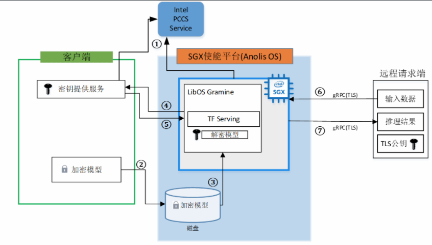

# 部署TensorFlow Serving在线推理服务

## 概述

本文介绍在Intel® SGX使能的平台，基于Anolis OS部署TensorFlow Serving在线推理服务的技术架构和使用流程。

## 背景信息
TensorFlow Serving是Google开源的机器学习平台TensorFlow生态的一部分，它的功能是将训练好的模型运行起来，提供接口给其他服务调用，以便使用模型进行推理预测。
阿里云ECS部分安全增强型实例基于Intel® SGX（Software Guard Extension）技术，提供了SGX加密计算能力，打造了基于硬件级别的更高安全等级的可信机密环境，保障关键代码和数据的机密性与完整性不受恶意软件的破坏。

将TensorFlow Serving在线推理场景部署在阿里云安全增强型实例可信机密环境中，可以保证数据传输的安全性、数据盘的安全性、数据使用的安全性、以及AI在线推理应用程序的完整性。
本实践为开发者使用Anolis OS提供了参考实现，您可以了解以下内容：
- 对基于SGX加密技术实现的端到端的全数据生命周期安全方案有整体了解。
- 对于使用TensorFlow Serving的开发者，可直接参照本实践部署和开发脚本。
- 为使用安全增强型实例的SGX开发者提供可行性参考框架和脚本，您可根据本实践步骤快速了解安全增强型实例以及环境搭建部署流程，轻松上手使用。

## 技术架构
本实践技术架构如下所示。



本实践涉及三个角色：客户端、Anolis OS SGX端、远程请求端。

- **客户端**：客户端机器会将训练完的模型以及用来建立安全连接的TLS证书进行加密，并将这些加密文件上传到Anolis OS SGX端环境中。同时，客户端机器还将部署密钥提供服务，主要用来对 SGX端进行认证，确保运行在云上的TensorFlow Serving推理服务应用的完整性及SGX环境的可行性。验证通过后，会将密钥发送给在 OS SGX中运行的TensorFlow Serving推理服务。

- **Anolis OS SGX端**：Anolis OS SGX端提供SGX机密计算环境，TensorFlow Serving推理服务运行在SGX环境中。当推理服务启动时，会向客户端发送远程认证请求，证明当前SGX环境的可行性和AI推理服务的完整性。验证成功后，推理服务会拿到客户端发送的密钥，并对加密的模型和TLS证书进行解密，至此，运行在SGX环境中的推理服务成功运行，并等待远程访问请求。

- **远程请求端**：第三方使用者通过网络安全传输，将数据发送到运行在SGX机密计算环境中的推理服务。推理完成后，得到返回结果。

    *说明：本实践将客户端和远程请求端部署在同一台机器，Anolis OS SGX端部署在另外一台机器。*

本实践使用到的其他组件如下：
- **LibOS**：Gramine是一款轻量级LibOS，结合Intel® SGX加密保护技术，提供了内核能力定制，运行资源消耗少，具备非常好的ABI兼容性，极大降低了原生应用移植到SGX环境的成本，做到了应用程序不修改或者极少的修改便能运行在SGX环境中。本实践使用Gramine封装TensorFlow Serving推理服务，将推理服务简单便捷地运行在SGX实例中。更多信息，请参见Gramine。

- **AI推理服务**：TensorFlow Serving是Google开源的机器学习平台TensorFlow生态的一部分，它的功能是将训练好的模型运行起来，提供接口给其他服务调用，以便使用模型进行推理预测。更多信息，请参见TensorFlow。

- **Docker容器引擎**：为了方便部署推理服务，本实践采用将推理服务运行在Container中的方式，利用Docker的命令方式运行推理服务。

本实践技术架构说明如下：
- Intel证书缓存服务PCCS（ProvisioningCertificate Caching Service）。如技术架构中①所示，Anolis OS SGX端需要向Intel PCCS获取PCK（Provisioning Certification Key）证书，Intel SGX会有一个密钥用于Enclave的签名，该密钥对于处理器或者平台是唯一的，密钥的公开部分就是PCK公钥。另外客户端也会向PCCS获取一些信息，比如TCB信息、Quote Enclave认证的信息、CRL信息等用于对SGX Enclave的认证。
- 搭建好Anolis OS SGX端后，可以将本地加密的模型文件以及TLS证书通过网络传输放到云盘中备用，如技术架构中②所示。
- 通过LibOS Gramine启动TensorFlow Serving推理服务时，会加载加密的模型文件，如技术架构中③所示。
- Gramine本身集成了远程认证的功能，在识别到有加密文件加载时，会转向配置好的远程IP服务发送认证请求，如技术架构中④所示。本实践在实现时，以一台阿里云实例模拟客户端，同时也作为远程访问端，另一台实例作为SGX环境。
- 在客户端的密钥提供服务对Anolis OS SGX端中的Enclave Quote认证成功后，会将模型加密的密钥发送给Gramine，如技术架构中⑤所示。由于此时Gramine是运行在Enclave中，因此Gramine拿到密钥对模型解密的过程是安全的。
- 在模型解密后，TensorFlow Serving便可以正常运行，并等待远端的访问请求。为了建立通信安全连接通道，远程访问端有TLS的公钥，在建立连接后，会对TensorFlow Serving中的TLS证书进行校验。如技术架构中⑥所示。
- 当TensorFlow Serving对远程请求端的数据推理完成后，便会通过建立的安全通道将推理结果返回给请求端，如技术架构中⑦所示。<br><br>

### **步骤一：部署客户端**

本实践运行的环境信息参考：
- 规格：加密内存≥8G
- 镜像： Ubuntu20.04
- 公网IP
- 安装SGX软件栈

1、环境配置

安装所需的mesa-libGL软件包。

```shell
sudo pip3 install --upgrade pip 
sudo pip install multidict
sudo yum install mesa-libGL
```

2、下载软件包

下载本实践所用的TensorFlow Serving脚本代码并安装所需的argparse、aiohttp、tensorflow等软件包。

```shell
git clone https://github.com/intel/confidential-computing-zoo.git
cd confidential-computing-zoo/cczoo/tensorflow-serving-cluster/ tensorflow-serving/docker/client/
pip3 install -r ./requirements.txt
```

3、下载模型

```shell
./download_model.sh
```
下载训练好的模型文件将会存放在创建的`models/resnet50-v15-fp32`目录下。

4、模型格式转换

为了兼容TensorFlow Serving，需要对训练好的模型文件进行格式转换。

```shell
python3 ./model_graph_to_saved_model.py --import_path `pwd -P`/models/resnet50-v15-fp32/resnet50-v15-fp32.pb --export_dir  `pwd -P`/models/resnet50-v15-fp32 --model_version 1 --inputs input --outputs  predict 
```

转换好的模型文件将会存放在models/resnet50-v15-fp32/1/saved_model.pb。

5、创建gRPC TLS证书

本实践选择`gRPC TLS`建立客户端和TensorFlow Serving之间的通信连接，并设置  TensorFlow Serving域名来创建单向`TLS Keys`和证书，用来建立安全通信通道。该脚本将会创建`ssl_configure`文件夹，里面包含server和client相应的证书。

```shell
service_domain_name=grpc.tf-serving.service.com
client_domain_name=client.tf-serving.service.com
./generate_twoway_ssl_config.sh ${service_domain_name} ${client_domain_name}
```

6、创建加密模型

```shell
mkdir plaintext/
mv models/resnet50-v15-fp32/1/saved_model.pb plaintext/
LD_LIBRARY_PATH=./libs ./gramine-sgx-pf-crypt encrypt -w files/wrap-key -i  plaintext/saved_model.pb -o  models/resnet50-v15-fp32/1/saved_model.pb
```

7、启动密钥验证服务。

本实践使用Gramine提供的`secret_prov_server_dcap`作为远端SGX Enclave Quote认证服务，底层依赖调用SGX DCAP提供的Quote相关的认证库，该认证服务会向阿里云PCCS获取Quote认证相关的数据，比如TCB相关信息以及CRL信息等。
    
SGX Enclave Quote验证成功后，会将当前目录下存放的密钥`files/wrap-key`发送到远端应用。这里远端应用为vSGX环境中的Gramine，Gramine拿到`wrap-key`中的密钥后，便会对加密的模型和TLS配置文件进行解密。

- a. 切换到secrec_prov_server目录

```shell
./download_model.sh
```
        
- b. 使用密钥验证服务镜像

    - I) 下载密钥验证服务镜像

    ```shell
    sudo docker pull intelcczoo/tensorflow_serving:anolis_secret_prov_server_latest
    ```

    - II) 根据脚本编译镜像

    ```shell
    sudo ./build_secret_prov_image.sh  
    ```

- c. 获取secret_prov_server镜像ID

```shell
sudo docker images  
```

- d. 启动密钥验证服务

```shell
sudo ./run_secret_prov.sh -i secret_prov_image_id -a pccs.service.com:ip_addr 
```

服务启动后便会在后台运行等待远程认证访问。当接收到远端认证后，认证通过会将密钥发送回远端。

- e. 查看secret_prov_server容器IP地址

```shell
sudo docker ps -a   #查看secret_prov_server镜像ID
sudo docker inspect -f '{{range .NetworkSettings.Networks}}{{.IPAddress}}{{end}}' <secret_prov_server_container_id> 
#<secret_prov_server_container_id>需修改为实际的secret_prov_container_id
```

### **步骤二：部署Anolis OS SGX端**

1、下载本实践所用的TensorFlow Serving脚本代码

```shell
git clone https://github.com/intel/confidential-computing-zoo.git
cd confidential-computing-zoo/cczoo/tensorflow-serving-cluster/tensorflow-serving/docker/tf_serving/
```

2、复制客户端的`ssl_configure`和`models`目录到Anolis OS SGX中的`tf_serving`目录中

```shell
scp -r tf@192.168.XX.XX:/<Tensorflow_Serving>/client/models  <Tensorflow_Serving>/docker/tf_serving
scp -r tf@192.168.XX.XX<Tensorflow_Serving>/client/ssl_configure  <Tensorflow_Serving>/docker/tf_serving
```

3、创建TensorFlow Serving镜像

用户可以通过下面任意方式获取TensorFlow Serving镜像：

- a. 下载TensorFlow Serving镜像

```shell
sudo docker pull intelcczoo/tensorflow_serving:anolis_tensorflow_serving_latest
```

- b. 自行编译TensorFlow Serving镜像

```shell
sudo ./build_gramine_tf_serving_image.sh image_tag
```

4、配置域名访问

```shell
sudo sh -c 'echo "remote_ip attestation.service.com" >> /etc/hosts'   #remote_ip请修改为客户端IP
```

*说明:当客户端与vSGX端部署在同一台ECS实例上，`remote_ip`为容器IP*

5、运行TensorFlow Serving

```shell
cp ssl_configure/ssl.cfg .
sudo ./run_gramine_tf_serving.sh -i ${image_id} -p 8500-8501 -m resnet50-v15-fp32 -s ssl.cfg -a attestation.service.com:remote_ip
```

*说明：`${image_id}`需修改为TensorFlow Serving的`image id`。
-p 8500-8501为TensorFlow Serving对应主机的端口。
`remote_ip`需修改为`secret prov server`所在机器的IP或者容器IP（TF Serving与secretprov sever位于同一台机器）*

### **步骤三：远端访问**

1、切换到客户端

```shell
cd confidential-computing-zoo/cczoo/tensorflow-serving-cluster/tensorflow-serving/docker/client/
```

2、获取client容器镜像

用户可以通过下面任意方式获取client镜像：

- a. 下载TensorFlow Serving镜像

```shell
sudo docker pull intelcczoo/tensorflow_serving:anolis_client_latest
```

- b. 自行编译client镜像

```shell
sudo docker build -f client.dockerfile . -t intelcczoo/tensorflow_serving:anolis_client_latest
```

3、运行并进入client容器

```shell
sudo docker run -it --add-host="grpc.tf-serving.service.com:<tf_serving_service_ip_addr>" intelcczoo/tensorflow_serving:anolis_client_latest bash
```

*说明：如果client和TensorFlow Serving 部署在同一台机器，tf_serving_service_ip_addr 为TensorFlow Serving容器IP地址。*

4、向TensorFlow Serving 发送远程访问请求

```shell
cd /client
python3 ./resnet_client_grpc.py -batch 1 -cnum 1 -loop 50 -url grpc.tf-serving.service.com:8500 -ca `pwd -P`/ssl_configure/ca_cert.pem -crt `pwd -P`/ssl_configure/client/cert.pem -key `pwd -P`/ssl_configure/client/key.pem
```

请求成功后会打印传输数据，并输出性能数据。
