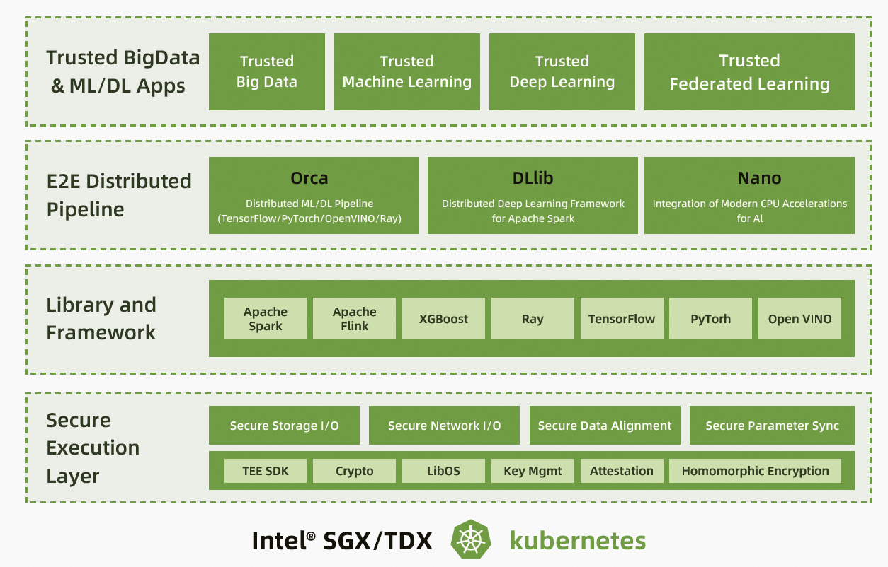

# PPML: 端到端隐私保护机器学习解决方案

## 项目位置链接

https://github.com/intel-analytics/BigDL

https://github.com/intel-analytics/BigDL/tree/main/ppml

## 归属社区SIG

云原生机密计算SIG

## 技术自身介绍

### 领域的问题和挑战

在众多计算应用场景中，大数据分析和人工智能已经成为不可或缺的关键环节。总体而言，数据越多，数据分析的价值越大，ML/DL的模型也会越完善。但囤积和处理海量数据也带来了隐私、安全和监管等风险。隐私保护机器学习（PPML，包含大数据分析和人工智能）有助于化解这些风险，能够在不透露原始数据的前提下，实现数据的有效流动，让使用方利用数据的价值。

### 对挑战的解决方案BigDL PPML

英特尔至强可扩展处理器为隐私保护机器学习提供了可信硬件执行环境 - 英特尔® SGX和英特尔®TDX。英特尔基于这些技术打造了端到端的大数据和人工智能隐私计算解决方案BigDL PPML。

BigDL是英特尔开源的统一的人工智能解决方案平台，数据科学家，数据工程师等开发者可以使用BigDL轻松创建端到端的分布式人工智能应用。BigDL应用英特尔SGX/TDX可信硬件执行环境（Trusted Execution Environment, TEE），并集成了其他软硬件安全措施，构建了一个分布式的隐私保护机器学习（Privacy Preserving Machine Learning, PPML）平台，能够保护端到端（包括数据输入，数据分析，机器学习，深度学习等各个阶段）的分布式人工智能应用。

### 技术介绍

上图是BigDL PPML预制工作流：
1.	用户通过BigDL PPML命令行向Kubernetes提交任务，此操作会创建一个驱动节点
2.	BigDL PPML客户端认证驱动节点
3.	驱动节点创建更多的工作节点
4.	驱动节点认证工作节点
5.	驱动节点和工作节点从密钥管理服务获取密钥
6.	工作节点读取输入数据并解密
7.	工作节点分布式运行大数据，机器学习或者深度学习任务

## 应用场景

### 场景描述

1、在加密数据上开发并运行标准的分布式人工智能应用（如大数据分析、机器学习、深度学习等）。

2、利用基于硬件的安全技术技术（如英特尔®SGX/TDX）保护计算过程以及相应的内存数据。

3、为人工智能应用提供端到端的安全和隐私保护，例如：

- 在具备英特尔®SGX/TDX硬件能力的K8s环境中创建并认证可信的集群环境
- 通过密钥管理系统（Key Management System, KMS）为分布式数据提供加密和解密能力
- 通过英特尔®SGX/TDX，加解密技术，TLS，安全认证等技术实现安全的分布式计算和数据通信

### 应用效果

1、BigDL PPML 端到端隐私保护机器学习解决方案继承了可信执行环境 (TEE) 的优点。和传统数据安全解决方案相比，它的安全性和数据效用性十分突出，同时性能损耗较低。

2、相比普通大数据分析工作流，BigDL PPML预制了可信安全的工作流。BigDL PPML工作流包括了：基于 SGX/TDX 的可信计算核心组件，支持 Apache Spark， Spark SQL 以及机器学习，深度学习等应用；经过抽象的认证服务客户端 API；经过抽象的密钥管理服务客户端 API；加密的数据传 输和存储；以及定制的 K8s 容器镜像。

3、使用BigDL PPML预制的工作流，开发者可以更加专注于业务逻辑的相关开发工作，利用 BigDL PPML 保障其应用的端到端安全性和隐私性。用户可以显著提高隐私计算应用的开发效率，大幅缩短实现隐私计算解决方案的开发时间 (Time to solution)。

4、通过应用该方案，企业能够构建端到端的安全保护流程，在数据输入、数据分析、机器学习、深度学习等 AI、大数据应用的多个阶段建立安全防护能力，避免安全威胁乘虚而入。同时，该方案实现了基于硬件底层的保护，具备更高的数据保护等级，能够防护传统安全方案难以抵抗的攻击形式，降低重要数据泄露的风险。

5、在该方案的支持下，企业能够提供安全的数据融通服务，联合分析、联合训练、联合预测等应用不透露原始数据以及基于数据应用逻辑层面的授权，保证场景化的数据融通安全需要；满足商业的自主性、可控性、安全性，为客户提供透明可控的安全流通环境，可随时管控和退出，永保数据控制权。

### 用户情况

- 蚂蚁集团安全团队适配了BigDL PPML, 为集团业务提供隐私大数据和机器学习的方案。

- 其他用户包括火山引擎，腾讯等。
