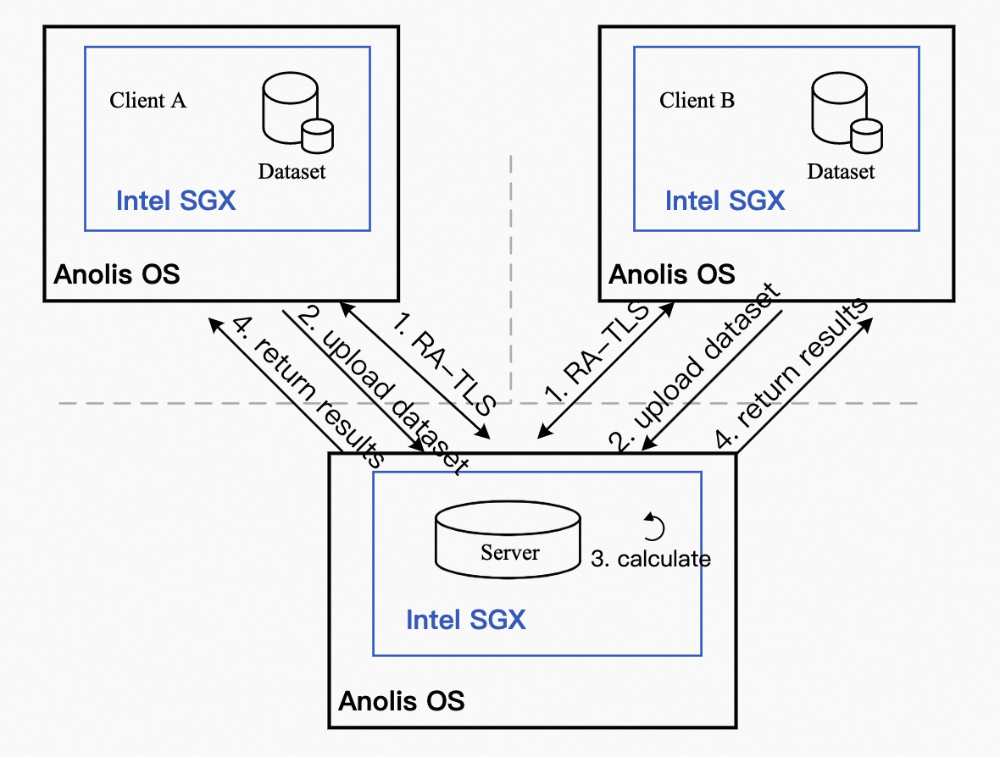

# 部署隐私集合求交方案
## 1 概述
本文介绍在Intel® SGX使能的平台，基于Anolis OS部署隐私集合求交方案。
## 2 背景信息
隐私集合求交（Private Set Intersection，PSI）是多方安全计算的应用热点，其目的是通过安全方案计算两方之间的交集，而不暴露交集之外的其他信息。我们采用了基于Intel SGX技术的隐私保护计算解决方案。

Intel® SGX (Software Guard Extension) 技术，提供了SGX加密计算能力，打造了基于硬件级别的更高安全等级的可信机密环境，保障关键代码和数据的机密性与完整性不受恶意软件的破坏。

本实践为开发者使用Anolis OS提供了参考实现，您可以通过本文获取以下信息：
- 对基于SGX加密技术实现的端到端的全数据生命周期安全方案有整体了解。
- 对于使用Anolis OS的开发者，可直接参照本实践部署和开发脚本。
- 为使用安全增强型云服务器SGX开发者提供可行性参考框架和脚本，开发者可根据本实践步骤快速了解安全增强型裸金属云服务器及环境搭建部署流程，轻松上手使用。

## 3 实践架构



本实践涉及了两种角色：客户端（Client）和服务端（Server）。
- 服务端：部署在Anolis OS安全增强型云服务器中，提供SGX机密计算环境，隐私求交服务运行在此环境中。当隐私求交启动后，服务端会等待客户端发送远程认证请求，证明当前SGX环境的可信性。所有客户端验证成功后，服务端会等待客户端上传待求交数据，待所有数据上传成功后，服务端计算交集并将结果发送回各个客户端。
- 客户端：客户端向服务端请求远程验证服务，远程验证通过后，客户端将本地待求交数据上传到服务端，并等待服务端完成求交并将结果发送回客户端。

说明：为了方便开发者部署，本实践将隐私集合求交方案参与方部署在同一台云服务器中。

本实践使用到的主要组件：
- LibOS：Gramine是一款轻量级LibOS，结合Intel SGX加密保护技术，提供了内核能力定制，运行资源消耗少，具备非常好的ABI兼容性，极大降低了原生应用移植到SGX环境的成本，做到了应用程序不修改或者极少的修改便能运行在SGX环境中。更多信息，请参考[Gramine](https://github.com/gramineproject/gramine)。
- Docker容器引擎：为了方便部署推理，本实践将参与方运行在Docker容器中，通过Docker的命令方式运行推理服务。

本实践架构说明：
Anolis OS SGX端需要向Intel证书缓存服务（Provisioning Certificate Caching Service，PCCS）获取PCK（Provisioning Certification Key）证书。Intel SGX拥有一个密钥用于Enclave签名，该密钥对于处理器或者平台是唯一的，密钥的公开部分就是PCK公钥。另外客户端也会向PCCS获取一些信息，比如TCB信息、Quote Enclave认证的信息、CRL信息等用于对SGX Enclave的认证。

训练阶段可以分为以下几个步骤：

&emsp;&ensp;**①** 所有参与者都在SGX环境中运行。每个客户端通过RA-TLS与服务端完成双向认证，以互相确认身份。

&emsp;&ensp;**②** 客户端通过RA-TLS增强型gRPC将数据安全传输到服务器。

&emsp;&ensp;**③** 服务端等待所有客户端的数据上传完成后，计算上传数据的交集。

&emsp;&ensp;**④** 服务端通过RA-TLS增强型gRPC将计算结果回传给每个参与的客户端。

由于客户端和参数服务器运行在内存加密的Enclave环境中，同时RA-TLS通信方案保证了传输过程中的数据安全，因此该方案可以保证在完整的训练周期中的数据安全。

## 4 实践任务和配置
本实践的环境配置如下：
- 服务器配置：
    - Anolis OS安全增强型云服务器
    - 单个节点加密内存：2G
- SGX软件栈
- Docker

## 5 实践部署
本实践提供两种部署方式：下载镜像和通过Dockerfile编译镜像。

### 5.1 下载镜像方式
#### 5.1.1 下载Docker镜像
```shell
docker pull intelcczoo/psi:anolis_sgx_latest
docker tag intelcczoo/psi:anolis_sgx_latest anolisos_psi:latest
```
#### 5.1.2 启动Docker容器
下载实践代码
```shell
git clone https://github.com/intel/confidential-computing-zoo.git
cd confidential-computing-zoo/cczoo/psi/
```

如运行两方求交，需启动三个Docker容器（server，client1，client2）;如运行三方求交，需启动四个Docker容器（server，client1，client2，client3）。在每个终端运行如下命令以启动Docker容器：

```shell
./start_container.sh <server/client1/client2/client3> <PCCS ip> anolisos
```

其中`<server/client1/client2/client3>`字段表示在不同的节点分别启动server和client，`<PCCS ip>`字段表示PCCS的IP地址。

#### 5.1.3 配置PCCS信息
在每个Docker容器的/etc/sgx_default_qcnl.conf文件中配置PCCS信息，如：

```shell
PCCS_URL=https://sgx-dcap-server.cn-beijing.aliyuncs.com/sgx/certification/v3/
USE_SECURE_CERT=TRUE
```

### 5.2 编译镜像方式
#### 5.2.1 下载实践源码
在已创建好的SGX实例中，下载本实践所使用到的代码。
```shell
git clone https://github.com/intel/confidential-computing-zoo.git
cd confidential-computing-zoo/
```

#### 5.2.2 编译Docker镜像
```shell
cd cczoo/common/docker/gramine
./build_docker_image.sh anolisos anolisos
cd -
cd cczoo/psi/gramine
./build_docker_image.sh anolisos
```

#### 5.2.3 启动Docker容器
如运行两方求交，需启动三个Docker容器（server，client1，client2）;如运行三方求交，需启动四个Docker容器（server，client1，client2，client3）。在每个终端运行如下命令以启动Docker容器：
```shell
./start_container.sh <server/client1/client2/client3> <PCCS ip> anolisos
```

其中`<server/client1/client2/client3>`字段表示在不同的节点分别启动server和client，`<PCCS ip>`字段表示PCCS的IP地址。

## 6 实践运行
本实践方案提供Python和C++两种版本。
### 6.1 Python版本
#### 6.1.1 编译Python程序
在每个启动的Docker容器中编译程序：
```shell
cd /gramine/CI-Examples/psi/python
./build.sh
```
在多台服务器上部署不同分布式节点的情况下，需要配置`dynamic_config.json`文件，填入待通信方节点在编译应用阶段生成的`MR_ENCLAVE`，`MR_SIGNER`，`ISV_PROD_ID`，`ISV_SVN`的值，如：
```json
{
    "verify_mr_enclave" : "on",
    "verify_mr_signer" : "on",
    "verify_isv_prod_id" : "on",
    "verify_isv_svn" : "on",
    "sgx_mrs": [
        {
            "mr_enclave" : "1e4f3efafac6038dadaa94fdd248b93c82ae9f0a16642ff4bb07afe442aac56e",
            "mr_signer" : "5add213ac35413033647621e2fab91edcc8b82f840426803feb8a603be2ce8d4",
            "isv_prod_id" : "0",
            "isv_svn" : "0"
        }
    ]
}
```
#### 6.1.2 运行两方求交程序
在每个Docker的容器中的`/gramine/CI-Examples/psi/python`路径下分别执行对应的参与方命令：
```shell
# Run the server
gramine-sgx python -u server.py -host localhost:50051 -config dynamic_config.json

# Run the client1
gramine-sgx python -u data_provider1.py -host localhost:50051 -config dynamic_config.json -is_chief True -data_dir "data1.txt" -client_num 2

# Run the client2
gramine-sgx python -u data_provider2.py -host localhost:50051 -config dynamic_config.json -is_chief False -data_dir "data2.txt" -client_num 2
```
每个客户端都会得到交集结果：
```shell
['car', 'cat', 'train']
```

#### 6.1.3 运行三方求交程序
在每个Docker的容器中的`/gramine/CI-Examples/psi/python`路径下分别执行对应的参与方命令：
```shell
# Kill the previous server process
pkill -f gramine
# Run the server
gramine-sgx python -u server.py -host localhost:50051 -config dynamic_config.json

# Run the client1
gramine-sgx python -u data_provider1.py -host localhost:50051 -config dynamic_config.json -is_chief True -data_dir "data1.txt" -client_num 3

# Run the client2
gramine-sgx python -u data_provider2.py -host localhost:50051 -config dynamic_config.json -is_chief False -data_dir "data2.txt" -client_num 3

# Run the client3
gramine-sgx python -u data_provider3.py -host localhost:50051 -config dynamic_config.json -is_chief False -data_dir "data3.txt" -client_num 3
```
每个客户端都会得到交集结果：
```shell
['train', 'car', 'cat']
```

### 6.2 C++版本
#### 6.2.1 编译C++程序
在每个启动的Docker容器中编译程序：
```shell
cd /gramine/CI-Examples/psi/cpp
./build.sh
```
在多台服务器上部署不同分布式节点的情况下，需要配置`dynamic_config.json`文件，填入待通信方节点在编译应用阶段生成的MR_ENCLAVE，MR_SIGNER，ISV_PROD_ID，ISV_SVN的值，如：
```json
{
    "verify_mr_enclave" : "on",
    "verify_mr_signer" : "on",
    "verify_isv_prod_id" : "on",
    "verify_isv_svn" : "on",
    "sgx_mrs": [
        {
            "mr_enclave" : "1e4f3efafac6038dadaa94fdd248b93c82ae9f0a16642ff4bb07afe442aac56e",
            "mr_signer" : "5add213ac35413033647621e2fab91edcc8b82f840426803feb8a603be2ce8d4",
            "isv_prod_id" : "0",
            "isv_svn" : "0"
        }
    ]
}
```

#### 6.2.2 运行两方求交程序
在每个Docker的容器中的`/gramine/CI-Examples/psi/cpp`路径下分别执行对应的参与方命令：
```shell
# Kill the previous server process
pkill -f gramine
# Run the server
cd runtime/server
gramine-sgx grpc -host=localhost:50051 -config=dynamic_config.json

# Run the client1
cd runtime/data_provider1
gramine-sgx grpc -host=localhost:50051 -config=dynamic_config.json -is_chief=true -client_num=2 data_dir="data1.txt" client_name="data_provider1"

# Run the client2
cd runtime/data_provider2
gramine-sgx grpc -host=localhost:50051 -config=dynamic_config.json -is_chief=false -client_num=2 data_dir="data2.txt" client_name="data_provider2"
```

每个客户端都会得到交集结果：
```shell
car
cat
train
```

#### 6.2.3 运行三方求交程序
在每个Docker的容器中的`/gramine/CI-Examples/psi/cpp`路径下分别执行对应的参与方命令：
```shell
# Kill the previous server process
pkill -f gramine
# Run the server
cd runtime/server
gramine-sgx grpc -host=localhost:50051 -config=dynamic_config.json

# Run the client1
cd runtime/data_provider1
gramine-sgx grpc -host=localhost:50051 -config=dynamic_config.json -is_chief=true -client_num=3 data_dir="data1.txt" client_name="data_provider1"

# Run the client2
cd -
cd runtime/data_provider2
gramine-sgx grpc -host=localhost:50051 -config=dynamic_config.json -is_chief=false -client_num=3 data_dir="data2.txt" client_name="data_provider2"

# Run the client3
cd -
cd runtime/data_provider3
gramine-sgx grpc -host=localhost:50051 -config=dynamic_config.json -is_chief=false -client_num=3 data_dir="data3.txt" client_name="data_provider3"
```

每个客户端都会得到交集结果：
```shell
car
cat
train
```
